# Class: Array Value (ArrayValue)


_A class to hold an array of values_


URI: [microbial_experiment_schema:ArrayValue](https://w3id.org/usnistgov/microbial-experiment-schema/ArrayValue)

```mermaid
 classDiagram
    class ArrayValue
    click ArrayValue href "../ArrayValue"
      ArrayValue <|-- CFUMethodValue
        click CFUMethodValue href "../CFUMethodValue"
      ArrayValue <|-- FixationMethodValue
        click FixationMethodValue href "../FixationMethodValue"
      ArrayValue <|-- FluorescentProbeValue
        click FluorescentProbeValue href "../FluorescentProbeValue"
      ArrayValue <|-- LabCASMicrobialMaterialIDValue
        click LabCASMicrobialMaterialIDValue href "../LabCASMicrobialMaterialIDValue"
      ArrayValue <|-- MicrobialMaterialIDValue
        click MicrobialMaterialIDValue href "../MicrobialMaterialIDValue"
      ArrayValue <|-- ModalitiesValue
        click ModalitiesValue href "../ModalitiesValue"
      ArrayValue <|-- ObjectivesValue
        click ObjectivesValue href "../ObjectivesValue"
      ArrayValue <|-- SamplePurposeCodesValue
        click SamplePurposeCodesValue href "../SamplePurposeCodesValue"
      ArrayValue <|-- SeriesImageTypesValue
        click SeriesImageTypesValue href "../SeriesImageTypesValue"
      ArrayValue <|-- TransmissionModeValue
        click TransmissionModeValue href "../TransmissionModeValue"
      
      ArrayValue : value
        
      
```





## Inheritance
* **ArrayValue**
    * [CFUMethodValue](CFUMethodValue.md)
    * [FixationMethodValue](FixationMethodValue.md)
    * [FluorescentProbeValue](FluorescentProbeValue.md)
    * [LabCASMicrobialMaterialIDValue](LabCASMicrobialMaterialIDValue.md)
    * [MicrobialMaterialIDValue](MicrobialMaterialIDValue.md)
    * [ModalitiesValue](ModalitiesValue.md)
    * [ObjectivesValue](ObjectivesValue.md)
    * [SamplePurposeCodesValue](SamplePurposeCodesValue.md)
    * [SeriesImageTypesValue](SeriesImageTypesValue.md)
    * [TransmissionModeValue](TransmissionModeValue.md)


## Slots

| Name | Cardinality and Range | Description | Inheritance |
| ---  | --- | --- | --- |
| [value](value.md) | 1..* <br/> [String](String.md) | The actual metadata value for an attribute | direct |


## Identifier and Mapping Information


### Schema Source


* from schema: https://w3id.org/usnistgov/microbial-experiment-schema


## Mappings

| Mapping Type | Mapped Value |
| ---  | ---  |
| self | microbial_experiment_schema:ArrayValue |
| native | microbial_experiment_schema:ArrayValue |


## LinkML Source

<!-- TODO: investigate https://stackoverflow.com/questions/37606292/how-to-create-tabbed-code-blocks-in-mkdocs-or-sphinx -->

### Direct

<details>
```yaml
name: ArrayValue
description: A class to hold an array of values
title: Array Value
from_schema: https://w3id.org/usnistgov/microbial-experiment-schema
slots:
- value
slot_usage:
  value:
    name: value
    multivalued: true
    inlined: false

```
</details>

### Induced

<details>
```yaml
name: ArrayValue
description: A class to hold an array of values
title: Array Value
from_schema: https://w3id.org/usnistgov/microbial-experiment-schema
slot_usage:
  value:
    name: value
    multivalued: true
    inlined: false
attributes:
  value:
    name: value
    description: The actual metadata value for an attribute
    title: value
    from_schema: https://w3id.org/usnistgov/microbial-experiment-schema
    rank: 1000
    alias: value
    owner: ArrayValue
    domain_of:
    - BooleanValue
    - NumberValue
    - StringValue
    - UriValue
    - DateValue
    - ArrayValue
    - ELabItemValue
    - FCInjectionModeValue
    - IncubationAtmosphereValue
    range: string
    required: true
    multivalued: true
    inlined: false

```
</details>