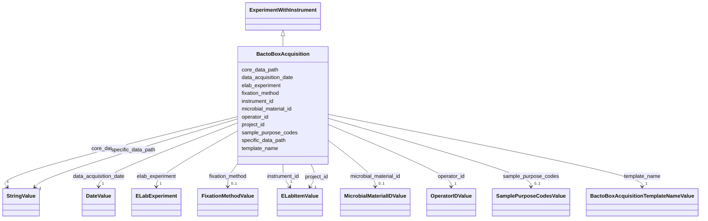

# Class: BactoBox_Acquisition (BactoBoxAcquisition)


_Metadata describing a data acquisition experiment using the BactoBox_


URI: [microbial_experiment_schema:BactoBoxAcquisition](https://w3id.org/usnistgov/microbial-experiment-schema/BactoBoxAcquisition)





## Inheritance
* [Experiment](Experiment.md)
    * [ExperimentWithData](ExperimentWithData.md)
        * [ExperimentWithInstrument](ExperimentWithInstrument.md)
            * **BactoBoxAcquisition**


## Slots

| Name | Cardinality and Range | Description | Inheritance |
| ---  | --- | --- | --- |
| [fixation_method](fixation_method.md) | 0..1 <br/> [FixationMethodValue](FixationMethodValue.md) | Specific treatment applied to cells to prevent future changes | direct |
| [microbial_material_id](microbial_material_id.md) | 0..1 <br/> [MicrobialMaterialIDValue](MicrobialMaterialIDValue.md) | Cell material(s) used in experiment as named in the eLabFTW database (linked ... | direct |
| [sample_purpose_codes](sample_purpose_codes.md) | 0..1 <br/> [SamplePurposeCodesValue](SamplePurposeCodesValue.md) | The types of samples acquired in an experiment (from a controlled list) | direct |
| [instrument_id](instrument_id.md) | 1 <br/> [ELabItemValue](ELabItemValue.md) | The instrument used to acquire the data in an experiment (linked item from EL... | [ExperimentWithInstrument](ExperimentWithInstrument.md) |
| [core_data_path](core_data_path.md) | 1 <br/> [StringValue](StringValue.md) | Portion of the data pathway that will not change as the template is used to g... | [ExperimentWithData](ExperimentWithData.md) |
| [specific_data_path](specific_data_path.md) | 1 <br/> [StringValue](StringValue.md) | Portion of the data pathway specific to data from a given experimental record... | [ExperimentWithData](ExperimentWithData.md) |
| [data_acquisition_date](data_acquisition_date.md) | 1 <br/> [DateValue](DateValue.md) | Date on which data were acquired according to eLabFTW record | [Experiment](Experiment.md) |
| [elab_experiment](elab_experiment.md) | 1 <br/> [ELabExperiment](ELabExperiment.md) | A self-reference to this experiment record | [Experiment](Experiment.md) |
| [operator_id](operator_id.md) | 1 <br/> [OperatorIDValue](OperatorIDValue.md) | Instrument operator during an experiment (a linked item from ELabFTW) | [Experiment](Experiment.md) |
| [project_id](project_id.md) | 1 <br/> [ELabItemValue](ELabItemValue.md) | The project that an experiment supports (link to an ELabFTW item) | [Experiment](Experiment.md) |
| [template_name](template_name.md) | 1 <br/> [BactoBoxAcquisitionTemplateNameValue](BactoBoxAcquisitionTemplateNameValue.md) | The name of the template used to collect metadata for an experiment in ELabFT... | [Experiment](Experiment.md) |


## Identifier and Mapping Information


### Annotations

| property | value |
| --- | --- |
| elabftw_template | True |


### Schema Source


* from schema: https://w3id.org/usnistgov/microbial-experiment-schema


## Mappings

| Mapping Type | Mapped Value |
| ---  | ---  |
| self | microbial_experiment_schema:BactoBoxAcquisition |
| native | microbial_experiment_schema:BactoBoxAcquisition |


## LinkML Source

<!-- TODO: investigate https://stackoverflow.com/questions/37606292/how-to-create-tabbed-code-blocks-in-mkdocs-or-sphinx -->

### Direct

<details>
```yaml
name: BactoBoxAcquisition
annotations:
  elabftw_template:
    tag: elabftw_template
    value: true
description: Metadata describing a data acquisition experiment using the BactoBox
title: BactoBox_Acquisition
from_schema: https://w3id.org/usnistgov/microbial-experiment-schema
is_a: ExperimentWithInstrument
slots:
- fixation_method
- microbial_material_id
- sample_purpose_codes
slot_usage:
  template_name:
    name: template_name
    range: BactoBoxAcquisitionTemplateNameValue

```
</details>

### Induced

<details>
```yaml
name: BactoBoxAcquisition
annotations:
  elabftw_template:
    tag: elabftw_template
    value: true
description: Metadata describing a data acquisition experiment using the BactoBox
title: BactoBox_Acquisition
from_schema: https://w3id.org/usnistgov/microbial-experiment-schema
is_a: ExperimentWithInstrument
slot_usage:
  template_name:
    name: template_name
    range: BactoBoxAcquisitionTemplateNameValue
attributes:
  fixation_method:
    name: fixation_method
    annotations:
      elabftw_group:
        tag: elabftw_group
        value: Generic Microbial
      elabftw_user_input:
        tag: elabftw_user_input
        value: true
    description: Specific treatment applied to cells to prevent future changes
    title: FixationMethod
    from_schema: https://w3id.org/usnistgov/microbial-experiment-schema
    rank: 1000
    ifabsent: None
    alias: fixation_method
    owner: BactoBoxAcquisition
    domain_of:
    - CytoFLEXAcquisition
    - GenericTemplateDeprecated
    - FormaldehydeFixation
    - MicroscopyAcquisition
    - GenericTemplate
    - CoulterAcquisition
    - BactoBoxAcquisition
    - LogCOMETSamplePrep
    - CFU
    range: FixationMethodValue
    required: false
  microbial_material_id:
    name: microbial_material_id
    annotations:
      elabftw_group:
        tag: elabftw_group
        value: LabCAS
      elabftw_user_input:
        tag: elabftw_user_input
        value: true
    description: Cell material(s) used in experiment as named in the eLabFTW database
      (linked items)
    title: MicrobialMaterialID
    from_schema: https://w3id.org/usnistgov/microbial-experiment-schema
    rank: 1000
    alias: microbial_material_id
    owner: BactoBoxAcquisition
    domain_of:
    - CytoFLEXAcquisition
    - NucleicAcidExtraction
    - CellCultureInBroth
    - GenericTemplateDeprecated
    - FormaldehydeFixation
    - MicroscopyAcquisition
    - GenericTemplate
    - CoulterAcquisition
    - BactoBoxAcquisition
    - LogCOMETSamplePrep
    - CFU
    - InitiateGrowthOfBSpizizenii
    range: MicrobialMaterialIDValue
    required: false
  sample_purpose_codes:
    name: sample_purpose_codes
    annotations:
      elabftw_group:
        tag: elabftw_group
        value: Generic Microbial
      elabftw_user_input:
        tag: elabftw_user_input
        value: true
    description: The types of samples acquired in an experiment (from a controlled
      list)
    title: SamplePurposeCodes
    from_schema: https://w3id.org/usnistgov/microbial-experiment-schema
    rank: 1000
    ifabsent: Positive control
    alias: sample_purpose_codes
    owner: BactoBoxAcquisition
    domain_of:
    - CytoFLEXAcquisition
    - NucleicAcidExtraction
    - CellCultureInBroth
    - GenericTemplateDeprecated
    - FormaldehydeFixation
    - MicroscopyAcquisition
    - GenericTemplate
    - CoulterAcquisition
    - BactoBoxAcquisition
    - LogCOMETSamplePrep
    - CFU
    - InitiateGrowthOfBSpizizenii
    range: SamplePurposeCodesValue
    required: false
  instrument_id:
    name: instrument_id
    annotations:
      elabftw_group:
        tag: elabftw_group
        value: LabCAS
      elabftw_user_input:
        tag: elabftw_user_input
        value: true
    description: The instrument used to acquire the data in an experiment (linked
      item from ELabFTW)
    title: InstrumentID
    from_schema: https://w3id.org/usnistgov/microbial-experiment-schema
    rank: 1000
    alias: instrument_id
    owner: BactoBoxAcquisition
    domain_of:
    - ExperimentWithInstrument
    - ExperimentWithInstrumentNoData
    range: ELabItemValue
    required: true
  core_data_path:
    name: core_data_path
    annotations:
      elabftw_group:
        tag: elabftw_group
        value: LabCAS
      elabftw_user_input:
        tag: elabftw_user_input
        value: true
      read_only:
        tag: read_only
        value: true
    description: Portion of the data pathway that will not change as the template
      is used to generate experimental records (should be network-resolvable)
    title: CoreDataPath
    from_schema: https://w3id.org/usnistgov/microbial-experiment-schema
    rank: 1000
    alias: core_data_path
    owner: BactoBoxAcquisition
    domain_of:
    - ExperimentWithData
    range: StringValue
    required: true
  specific_data_path:
    name: specific_data_path
    annotations:
      elabftw_group:
        tag: elabftw_group
        value: LabCAS
      elabftw_user_input:
        tag: elabftw_user_input
        value: true
    description: Portion of the data pathway specific to data from a given experimental
      record  (should be a sub-path of the location specified by `CoreDataPath`)
    title: SpecificDataPath
    from_schema: https://w3id.org/usnistgov/microbial-experiment-schema
    rank: 1000
    alias: specific_data_path
    owner: BactoBoxAcquisition
    domain_of:
    - ExperimentWithData
    range: StringValue
    required: true
  data_acquisition_date:
    name: data_acquisition_date
    annotations:
      elabftw_group:
        tag: elabftw_group
        value: LabCAS
      elabftw_user_input:
        tag: elabftw_user_input
        value: true
    description: Date on which data were acquired according to eLabFTW record
    title: DataAcquisitionDate
    from_schema: https://w3id.org/usnistgov/microbial-experiment-schema
    rank: 1000
    alias: data_acquisition_date
    owner: BactoBoxAcquisition
    domain_of:
    - Experiment
    range: DateValue
    required: true
  elab_experiment:
    name: elab_experiment
    annotations:
      elabftw_user_input:
        tag: elabftw_user_input
        value: false
    description: A self-reference to this experiment record
    title: ELabFTW Experiment
    from_schema: https://w3id.org/usnistgov/microbial-experiment-schema
    rank: 1000
    alias: elab_experiment
    owner: BactoBoxAcquisition
    domain_of:
    - Experiment
    range: ELabExperiment
    required: true
    inlined: true
    inlined_as_list: true
  operator_id:
    name: operator_id
    annotations:
      elabftw_group:
        tag: elabftw_group
        value: LabCAS
      elabftw_user_input:
        tag: elabftw_user_input
        value: true
    description: Instrument operator during an experiment (a linked item from ELabFTW)
    title: OperatorID
    from_schema: https://w3id.org/usnistgov/microbial-experiment-schema
    rank: 1000
    alias: operator_id
    owner: BactoBoxAcquisition
    domain_of:
    - Experiment
    range: OperatorIDValue
    required: true
  project_id:
    name: project_id
    annotations:
      elabftw_group:
        tag: elabftw_group
        value: LabCAS
      elabftw_user_input:
        tag: elabftw_user_input
        value: true
    description: The project that an experiment supports (link to an ELabFTW item)
    title: ProjectID
    from_schema: https://w3id.org/usnistgov/microbial-experiment-schema
    rank: 1000
    alias: project_id
    owner: BactoBoxAcquisition
    domain_of:
    - Experiment
    range: ELabItemValue
    required: true
  template_name:
    name: template_name
    annotations:
      elabftw_group:
        tag: elabftw_group
        value: LabCAS
      read_only:
        tag: read_only
        value: true
      elabftw_user_input:
        tag: elabftw_user_input
        value: true
    description: The name of the template used to collect metadata for an experiment
      in ELabFTW. This value controls what specific metadata fields are allowed.
    title: TemplateName
    from_schema: https://w3id.org/usnistgov/microbial-experiment-schema
    rank: 1000
    alias: template_name
    owner: BactoBoxAcquisition
    domain_of:
    - Experiment
    range: BactoBoxAcquisitionTemplateNameValue
    required: true

```
</details>