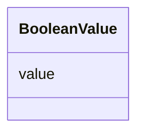

# Class: Boolean Value (BooleanValue)


_A class to hold a boolean value_


URI: [microbial_experiment_schema:BooleanValue](https://w3id.org/usnistgov/microbial-experiment-schema/BooleanValue)





<!-- no inheritance hierarchy -->


## Slots

| Name | Cardinality and Range | Description | Inheritance |
| ---  | --- | --- | --- |
| [value](value.md) | 1 <br/> [Boolean](Boolean.md) | The actual metadata value for an attribute | direct |


## Usages

| used by | used in | type | used |
| ---  | --- | --- | --- |
| [CytoFLEXVolumeCalibration](CytoFLEXVolumeCalibration.md) | [passed_volume_calibration](passed_volume_calibration.md) | range | [BooleanValue](BooleanValue.md) |
| [GenericTemplateDeprecated](GenericTemplateDeprecated.md) | [error_flag](error_flag.md) | range | [BooleanValue](BooleanValue.md) |
| [MicroscopyAcquisition](MicroscopyAcquisition.md) | [series_images](series_images.md) | range | [BooleanValue](BooleanValue.md) |
| [MicroscopyAcquisition](MicroscopyAcquisition.md) | [single_images](single_images.md) | range | [BooleanValue](BooleanValue.md) |
| [GenericTemplate](GenericTemplate.md) | [passed_volume_calibration](passed_volume_calibration.md) | range | [BooleanValue](BooleanValue.md) |
| [GenericTemplate](GenericTemplate.md) | [series_images](series_images.md) | range | [BooleanValue](BooleanValue.md) |
| [GenericTemplate](GenericTemplate.md) | [single_images](single_images.md) | range | [BooleanValue](BooleanValue.md) |


## Identifier and Mapping Information


### Schema Source


* from schema: https://w3id.org/usnistgov/microbial-experiment-schema


## Mappings

| Mapping Type | Mapped Value |
| ---  | ---  |
| self | microbial_experiment_schema:BooleanValue |
| native | microbial_experiment_schema:BooleanValue |


## LinkML Source

<!-- TODO: investigate https://stackoverflow.com/questions/37606292/how-to-create-tabbed-code-blocks-in-mkdocs-or-sphinx -->

### Direct

<details>
```yaml
name: BooleanValue
description: A class to hold a boolean value
title: Boolean Value
from_schema: https://w3id.org/usnistgov/microbial-experiment-schema
slots:
- value
slot_usage:
  value:
    name: value
    range: boolean

```
</details>

### Induced

<details>
```yaml
name: BooleanValue
description: A class to hold a boolean value
title: Boolean Value
from_schema: https://w3id.org/usnistgov/microbial-experiment-schema
slot_usage:
  value:
    name: value
    range: boolean
attributes:
  value:
    name: value
    description: The actual metadata value for an attribute
    title: value
    from_schema: https://w3id.org/usnistgov/microbial-experiment-schema
    rank: 1000
    alias: value
    owner: BooleanValue
    domain_of:
    - BooleanValue
    - NumberValue
    - StringValue
    - UriValue
    - DateValue
    - ArrayValue
    - ELabItemValue
    - FCInjectionModeValue
    - IncubationAtmosphereValue
    range: boolean
    required: true

```
</details>