# Class: CFU (CFU)


_Metadata describing a colony forming unit counting experiment_


URI: [microbial_experiment_schema:CFU](https://w3id.org/usnistgov/microbial-experiment-schema/CFU)

```mermaid
 classDiagram
    class CFU
    click CFU href "../CFU"
      ExperimentWithData <|-- CFU
        click ExperimentWithData href "../ExperimentWithData"
      
      CFU : cfu_method
        
          
    
    
    CFU --> "0..1" CFUMethodValue : cfu_method
    click CFUMethodValue href "../CFUMethodValue"

        
      CFU : core_data_path
        
          
    
    
    CFU --> "1" StringValue : core_data_path
    click StringValue href "../StringValue"

        
      CFU : data_acquisition_date
        
          
    
    
    CFU --> "1" DateValue : data_acquisition_date
    click DateValue href "../DateValue"

        
      CFU : elab_experiment
        
          
    
    
    CFU --> "1" ELabExperiment : elab_experiment
    click ELabExperiment href "../ELabExperiment"

        
      CFU : fixation_method
        
          
    
    
    CFU --> "0..1" FixationMethodValue : fixation_method
    click FixationMethodValue href "../FixationMethodValue"

        
      CFU : growth_media_name
        
          
    
    
    CFU --> "0..1" ELabItemValue : growth_media_name
    click ELabItemValue href "../ELabItemValue"

        
      CFU : incubation_atmosphere
        
          
    
    
    CFU --> "0..1" IncubationAtmosphereValue : incubation_atmosphere
    click IncubationAtmosphereValue href "../IncubationAtmosphereValue"

        
      CFU : incubation_duration
        
          
    
    
    CFU --> "0..1" DurationValue : incubation_duration
    click DurationValue href "../DurationValue"

        
      CFU : incubation_temperature
        
          
    
    
    CFU --> "0..1" TemperatureValue : incubation_temperature
    click TemperatureValue href "../TemperatureValue"

        
      CFU : microbial_material_id
        
          
    
    
    CFU --> "0..1" MicrobialMaterialIDValue : microbial_material_id
    click MicrobialMaterialIDValue href "../MicrobialMaterialIDValue"

        
      CFU : operator_id
        
          
    
    
    CFU --> "1" OperatorIDValue : operator_id
    click OperatorIDValue href "../OperatorIDValue"

        
      CFU : project_id
        
          
    
    
    CFU --> "1" ELabItemValue : project_id
    click ELabItemValue href "../ELabItemValue"

        
      CFU : sample_purpose_codes
        
          
    
    
    CFU --> "0..1" SamplePurposeCodesValue : sample_purpose_codes
    click SamplePurposeCodesValue href "../SamplePurposeCodesValue"

        
      CFU : specific_data_path
        
          
    
    
    CFU --> "1" StringValue : specific_data_path
    click StringValue href "../StringValue"

        
      CFU : template_name
        
          
    
    
    CFU --> "1" CFUTemplateNameValue : template_name
    click CFUTemplateNameValue href "../CFUTemplateNameValue"

        
      
```





## Inheritance
* [Experiment](Experiment.md)
    * [ExperimentWithData](ExperimentWithData.md)
        * **CFU**


## Slots

| Name | Cardinality and Range | Description | Inheritance |
| ---  | --- | --- | --- |
| [cfu_method](cfu_method.md) | 0..1 <br/> [CFUMethodValue](CFUMethodValue.md) | Describes deposition format of cells on agar plate | direct |
| [fixation_method](fixation_method.md) | 0..1 <br/> [FixationMethodValue](FixationMethodValue.md) | Specific treatment applied to cells to prevent future changes | direct |
| [growth_media_name](growth_media_name.md) | 0..1 <br/> [ELabItemValue](ELabItemValue.md) | Name of media used to culture cells (linked item from ELabFTW) | direct |
| [incubation_atmosphere](incubation_atmosphere.md) | 0..1 <br/> [IncubationAtmosphereValue](IncubationAtmosphereValue.md) | Atmosphere that cells were incubated in to encourage growth | direct |
| [incubation_duration](incubation_duration.md) | 0..1 <br/> [DurationValue](DurationValue.md) | Length of time that cells were incubated during an experiment | direct |
| [incubation_temperature](incubation_temperature.md) | 0..1 <br/> [TemperatureValue](TemperatureValue.md) | Temperature at which cells were incubated during an experiment or culture | direct |
| [microbial_material_id](microbial_material_id.md) | 0..1 <br/> [MicrobialMaterialIDValue](MicrobialMaterialIDValue.md) | Cell material(s) used in experiment as named in the eLabFTW database (linked ... | direct |
| [sample_purpose_codes](sample_purpose_codes.md) | 0..1 <br/> [SamplePurposeCodesValue](SamplePurposeCodesValue.md) | The types of samples acquired in an experiment (from a controlled list) | direct |
| [core_data_path](core_data_path.md) | 1 <br/> [StringValue](StringValue.md) | Portion of the data pathway that will not change as the template is used to g... | [ExperimentWithData](ExperimentWithData.md) |
| [specific_data_path](specific_data_path.md) | 1 <br/> [StringValue](StringValue.md) | Portion of the data pathway specific to data from a given experimental record... | [ExperimentWithData](ExperimentWithData.md) |
| [data_acquisition_date](data_acquisition_date.md) | 1 <br/> [DateValue](DateValue.md) | Date on which data were acquired according to eLabFTW record | [Experiment](Experiment.md) |
| [elab_experiment](elab_experiment.md) | 1 <br/> [ELabExperiment](ELabExperiment.md) | A self-reference to this experiment record | [Experiment](Experiment.md) |
| [operator_id](operator_id.md) | 1 <br/> [OperatorIDValue](OperatorIDValue.md) | Instrument operator during an experiment (a linked item from ELabFTW) | [Experiment](Experiment.md) |
| [project_id](project_id.md) | 1 <br/> [ELabItemValue](ELabItemValue.md) | The project that an experiment supports (link to an ELabFTW item) | [Experiment](Experiment.md) |
| [template_name](template_name.md) | 1 <br/> [CFUTemplateNameValue](CFUTemplateNameValue.md) | The name of the template used to collect metadata for an experiment in ELabFT... | [Experiment](Experiment.md) |


## Identifier and Mapping Information


### Annotations

| property | value |
| --- | --- |
| elabftw_template | True |


### Schema Source


* from schema: https://w3id.org/usnistgov/microbial-experiment-schema


## Mappings

| Mapping Type | Mapped Value |
| ---  | ---  |
| self | microbial_experiment_schema:CFU |
| native | microbial_experiment_schema:CFU |


## LinkML Source

<!-- TODO: investigate https://stackoverflow.com/questions/37606292/how-to-create-tabbed-code-blocks-in-mkdocs-or-sphinx -->

### Direct

<details>
```yaml
name: CFU
annotations:
  elabftw_template:
    tag: elabftw_template
    value: true
description: Metadata describing a colony forming unit counting experiment
title: CFU
from_schema: https://w3id.org/usnistgov/microbial-experiment-schema
is_a: ExperimentWithData
slots:
- cfu_method
- fixation_method
- growth_media_name
- incubation_atmosphere
- incubation_duration
- incubation_temperature
- microbial_material_id
- sample_purpose_codes
slot_usage:
  template_name:
    name: template_name
    range: CFUTemplateNameValue

```
</details>

### Induced

<details>
```yaml
name: CFU
annotations:
  elabftw_template:
    tag: elabftw_template
    value: true
description: Metadata describing a colony forming unit counting experiment
title: CFU
from_schema: https://w3id.org/usnistgov/microbial-experiment-schema
is_a: ExperimentWithData
slot_usage:
  template_name:
    name: template_name
    range: CFUTemplateNameValue
attributes:
  cfu_method:
    name: cfu_method
    description: Describes deposition format of cells on agar plate
    title: CFUMethod
    from_schema: https://w3id.org/usnistgov/microbial-experiment-schema
    rank: 1000
    alias: cfu_method
    owner: CFU
    domain_of:
    - GenericTemplateDeprecated
    - GenericTemplate
    - CFU
    range: CFUMethodValue
    required: false
  fixation_method:
    name: fixation_method
    annotations:
      elabftw_group:
        tag: elabftw_group
        value: Generic Microbial
      elabftw_user_input:
        tag: elabftw_user_input
        value: true
    description: Specific treatment applied to cells to prevent future changes
    title: FixationMethod
    from_schema: https://w3id.org/usnistgov/microbial-experiment-schema
    rank: 1000
    ifabsent: None
    alias: fixation_method
    owner: CFU
    domain_of:
    - CytoFLEXAcquisition
    - GenericTemplateDeprecated
    - FormaldehydeFixation
    - MicroscopyAcquisition
    - GenericTemplate
    - CoulterAcquisition
    - BactoBoxAcquisition
    - LogCOMETSamplePrep
    - CFU
    range: FixationMethodValue
    required: false
  growth_media_name:
    name: growth_media_name
    description: Name of media used to culture cells (linked item from ELabFTW)
    title: GrowthMediaName
    from_schema: https://w3id.org/usnistgov/microbial-experiment-schema
    rank: 1000
    alias: growth_media_name
    owner: CFU
    domain_of:
    - CellCultureInBroth
    - GenericTemplateDeprecated
    - GenericTemplate
    - CFU
    - InitiateGrowthOfBSpizizenii
    range: ELabItemValue
    required: false
  incubation_atmosphere:
    name: incubation_atmosphere
    annotations:
      elabftw_group:
        tag: elabftw_group
        value: Generic Microbial
      elabftw_user_input:
        tag: elabftw_user_input
        value: true
    description: Atmosphere that cells were incubated in to encourage growth
    title: IncubationAtmosphere
    from_schema: https://w3id.org/usnistgov/microbial-experiment-schema
    rank: 1000
    alias: incubation_atmosphere
    owner: CFU
    domain_of:
    - CytoFLEXAcquisition
    - CellCultureInBroth
    - GenericTemplateDeprecated
    - FormaldehydeFixation
    - MicroscopyAcquisition
    - GenericTemplate
    - CFU
    - InitiateGrowthOfBSpizizenii
    range: IncubationAtmosphereValue
    required: false
  incubation_duration:
    name: incubation_duration
    annotations:
      elabftw_group:
        tag: elabftw_group
        value: Generic Microbial
      elabftw_user_input:
        tag: elabftw_user_input
        value: true
      elabftw_default_unit:
        tag: elabftw_default_unit
        value: hr
    description: Length of time that cells were incubated during an experiment
    title: IncubationDuration
    from_schema: https://w3id.org/usnistgov/microbial-experiment-schema
    rank: 1000
    alias: incubation_duration
    owner: CFU
    domain_of:
    - CytoFLEXAcquisition
    - CellCultureInBroth
    - GenericTemplateDeprecated
    - FormaldehydeFixation
    - MicroscopyAcquisition
    - GenericTemplate
    - CFU
    - InitiateGrowthOfBSpizizenii
    range: DurationValue
    required: false
  incubation_temperature:
    name: incubation_temperature
    annotations:
      elabftw_group:
        tag: elabftw_group
        value: Generic Microbial
      elabftw_user_input:
        tag: elabftw_user_input
        value: true
      elabftw_default_unit:
        tag: elabftw_default_unit
        value: oC
    description: Temperature at which cells were incubated during an experiment or
      culture
    title: IncubationTemperature
    from_schema: https://w3id.org/usnistgov/microbial-experiment-schema
    rank: 1000
    alias: incubation_temperature
    owner: CFU
    domain_of:
    - CytoFLEXAcquisition
    - CellCultureInBroth
    - GenericTemplateDeprecated
    - FormaldehydeFixation
    - MicroscopyAcquisition
    - GenericTemplate
    - CFU
    - InitiateGrowthOfBSpizizenii
    range: TemperatureValue
    required: false
  microbial_material_id:
    name: microbial_material_id
    annotations:
      elabftw_group:
        tag: elabftw_group
        value: LabCAS
      elabftw_user_input:
        tag: elabftw_user_input
        value: true
    description: Cell material(s) used in experiment as named in the eLabFTW database
      (linked items)
    title: MicrobialMaterialID
    from_schema: https://w3id.org/usnistgov/microbial-experiment-schema
    rank: 1000
    alias: microbial_material_id
    owner: CFU
    domain_of:
    - CytoFLEXAcquisition
    - NucleicAcidExtraction
    - CellCultureInBroth
    - GenericTemplateDeprecated
    - FormaldehydeFixation
    - MicroscopyAcquisition
    - GenericTemplate
    - CoulterAcquisition
    - BactoBoxAcquisition
    - LogCOMETSamplePrep
    - CFU
    - InitiateGrowthOfBSpizizenii
    range: MicrobialMaterialIDValue
    required: false
  sample_purpose_codes:
    name: sample_purpose_codes
    annotations:
      elabftw_group:
        tag: elabftw_group
        value: Generic Microbial
      elabftw_user_input:
        tag: elabftw_user_input
        value: true
    description: The types of samples acquired in an experiment (from a controlled
      list)
    title: SamplePurposeCodes
    from_schema: https://w3id.org/usnistgov/microbial-experiment-schema
    rank: 1000
    ifabsent: Positive control
    alias: sample_purpose_codes
    owner: CFU
    domain_of:
    - CytoFLEXAcquisition
    - NucleicAcidExtraction
    - CellCultureInBroth
    - GenericTemplateDeprecated
    - FormaldehydeFixation
    - MicroscopyAcquisition
    - GenericTemplate
    - CoulterAcquisition
    - BactoBoxAcquisition
    - LogCOMETSamplePrep
    - CFU
    - InitiateGrowthOfBSpizizenii
    range: SamplePurposeCodesValue
    required: false
  core_data_path:
    name: core_data_path
    annotations:
      elabftw_group:
        tag: elabftw_group
        value: LabCAS
      elabftw_user_input:
        tag: elabftw_user_input
        value: true
      read_only:
        tag: read_only
        value: true
    description: Portion of the data pathway that will not change as the template
      is used to generate experimental records (should be network-resolvable)
    title: CoreDataPath
    from_schema: https://w3id.org/usnistgov/microbial-experiment-schema
    rank: 1000
    alias: core_data_path
    owner: CFU
    domain_of:
    - ExperimentWithData
    range: StringValue
    required: true
  specific_data_path:
    name: specific_data_path
    annotations:
      elabftw_group:
        tag: elabftw_group
        value: LabCAS
      elabftw_user_input:
        tag: elabftw_user_input
        value: true
    description: Portion of the data pathway specific to data from a given experimental
      record  (should be a sub-path of the location specified by `CoreDataPath`)
    title: SpecificDataPath
    from_schema: https://w3id.org/usnistgov/microbial-experiment-schema
    rank: 1000
    alias: specific_data_path
    owner: CFU
    domain_of:
    - ExperimentWithData
    range: StringValue
    required: true
  data_acquisition_date:
    name: data_acquisition_date
    annotations:
      elabftw_group:
        tag: elabftw_group
        value: LabCAS
      elabftw_user_input:
        tag: elabftw_user_input
        value: true
    description: Date on which data were acquired according to eLabFTW record
    title: DataAcquisitionDate
    from_schema: https://w3id.org/usnistgov/microbial-experiment-schema
    rank: 1000
    alias: data_acquisition_date
    owner: CFU
    domain_of:
    - Experiment
    range: DateValue
    required: true
  elab_experiment:
    name: elab_experiment
    annotations:
      elabftw_user_input:
        tag: elabftw_user_input
        value: false
    description: A self-reference to this experiment record
    title: ELabFTW Experiment
    from_schema: https://w3id.org/usnistgov/microbial-experiment-schema
    rank: 1000
    alias: elab_experiment
    owner: CFU
    domain_of:
    - Experiment
    range: ELabExperiment
    required: true
    inlined: true
    inlined_as_list: true
  operator_id:
    name: operator_id
    annotations:
      elabftw_group:
        tag: elabftw_group
        value: LabCAS
      elabftw_user_input:
        tag: elabftw_user_input
        value: true
    description: Instrument operator during an experiment (a linked item from ELabFTW)
    title: OperatorID
    from_schema: https://w3id.org/usnistgov/microbial-experiment-schema
    rank: 1000
    alias: operator_id
    owner: CFU
    domain_of:
    - Experiment
    range: OperatorIDValue
    required: true
  project_id:
    name: project_id
    annotations:
      elabftw_group:
        tag: elabftw_group
        value: LabCAS
      elabftw_user_input:
        tag: elabftw_user_input
        value: true
    description: The project that an experiment supports (link to an ELabFTW item)
    title: ProjectID
    from_schema: https://w3id.org/usnistgov/microbial-experiment-schema
    rank: 1000
    alias: project_id
    owner: CFU
    domain_of:
    - Experiment
    range: ELabItemValue
    required: true
  template_name:
    name: template_name
    annotations:
      elabftw_group:
        tag: elabftw_group
        value: LabCAS
      read_only:
        tag: read_only
        value: true
      elabftw_user_input:
        tag: elabftw_user_input
        value: true
    description: The name of the template used to collect metadata for an experiment
      in ELabFTW. This value controls what specific metadata fields are allowed.
    title: TemplateName
    from_schema: https://w3id.org/usnistgov/microbial-experiment-schema
    rank: 1000
    alias: template_name
    owner: CFU
    domain_of:
    - Experiment
    range: CFUTemplateNameValue
    required: true

```
</details>