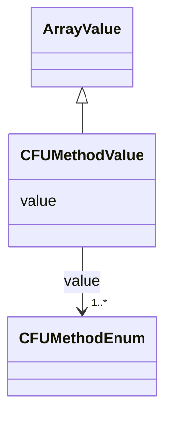

# Class: CFU Method Value (CFUMethodValue)


_An override of ArrayValue allowing only values from the CFUMethodEnum enum_


URI: [microbial_experiment_schema:CFUMethodValue](https://w3id.org/usnistgov/microbial-experiment-schema/CFUMethodValue)





## Inheritance
* [ArrayValue](ArrayValue.md)
    * **CFUMethodValue**


## Slots

| Name | Cardinality and Range | Description | Inheritance |
| ---  | --- | --- | --- |
| [value](value.md) | 1..* <br/> [CFUMethodEnum](CFUMethodEnum.md) | Describes deposition format of cells on agar plate | [ArrayValue](ArrayValue.md) |


## Usages

| used by | used in | type | used |
| ---  | --- | --- | --- |
| [GenericTemplateDeprecated](GenericTemplateDeprecated.md) | [cfu_method](cfu_method.md) | range | [CFUMethodValue](CFUMethodValue.md) |
| [GenericTemplate](GenericTemplate.md) | [cfu_method](cfu_method.md) | range | [CFUMethodValue](CFUMethodValue.md) |
| [CFU](CFU.md) | [cfu_method](cfu_method.md) | range | [CFUMethodValue](CFUMethodValue.md) |


## Identifier and Mapping Information


### Schema Source


* from schema: https://w3id.org/usnistgov/microbial-experiment-schema


## Mappings

| Mapping Type | Mapped Value |
| ---  | ---  |
| self | microbial_experiment_schema:CFUMethodValue |
| native | microbial_experiment_schema:CFUMethodValue |


## LinkML Source

<!-- TODO: investigate https://stackoverflow.com/questions/37606292/how-to-create-tabbed-code-blocks-in-mkdocs-or-sphinx -->

### Direct

<details>
```yaml
name: CFUMethodValue
description: An override of ArrayValue allowing only values from the CFUMethodEnum
  enum
title: CFU Method Value
from_schema: https://w3id.org/usnistgov/microbial-experiment-schema
is_a: ArrayValue
slot_usage:
  value:
    name: value
    description: Describes deposition format of cells on agar plate
    range: CFUMethodEnum

```
</details>

### Induced

<details>
```yaml
name: CFUMethodValue
description: An override of ArrayValue allowing only values from the CFUMethodEnum
  enum
title: CFU Method Value
from_schema: https://w3id.org/usnistgov/microbial-experiment-schema
is_a: ArrayValue
slot_usage:
  value:
    name: value
    description: Describes deposition format of cells on agar plate
    range: CFUMethodEnum
attributes:
  value:
    name: value
    description: Describes deposition format of cells on agar plate
    title: value
    from_schema: https://w3id.org/usnistgov/microbial-experiment-schema
    rank: 1000
    alias: value
    owner: CFUMethodValue
    domain_of:
    - BooleanValue
    - NumberValue
    - StringValue
    - UriValue
    - DateValue
    - ArrayValue
    - ELabItemValue
    - FCInjectionModeValue
    - IncubationAtmosphereValue
    range: CFUMethodEnum
    required: true
    multivalued: true
    inlined: false

```
</details>