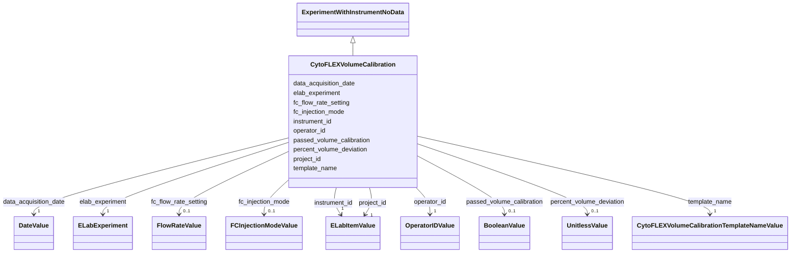

# Class: CytoFLEX_VolumeCalibration (CytoFLEXVolumeCalibration)


_Metadata describing a volume calibration using the CytoFLEX instrument_


URI: [microbial_experiment_schema:CytoFLEXVolumeCalibration](https://w3id.org/usnistgov/microbial-experiment-schema/CytoFLEXVolumeCalibration)





## Inheritance
* [Experiment](Experiment.md)
    * [ExperimentWithInstrumentNoData](ExperimentWithInstrumentNoData.md)
        * **CytoFLEXVolumeCalibration**


## Slots

| Name | Cardinality and Range | Description | Inheritance |
| ---  | --- | --- | --- |
| [fc_flow_rate_setting](fc_flow_rate_setting.md) | 0..1 <br/> [FlowRateValue](FlowRateValue.md) | Set flow rate of data acquisition on flow cytometer | direct |
| [fc_injection_mode](fc_injection_mode.md) | 0..1 <br/> [FCInjectionModeValue](FCInjectionModeValue.md) | Sample acquisition format in flow cytometer | direct |
| [passed_volume_calibration](passed_volume_calibration.md) | 0..1 <br/> [BooleanValue](BooleanValue.md) | (?) The volume that is passed during a volume calibration | direct |
| [percent_volume_deviation](percent_volume_deviation.md) | 0..1 <br/> [UnitlessValue](UnitlessValue.md) | The volume deviation (measured volume divided by target volume) from a calibr... | direct |
| [instrument_id](instrument_id.md) | 1 <br/> [ELabItemValue](ELabItemValue.md) | The instrument used to acquire the data in an experiment (linked item from EL... | [ExperimentWithInstrumentNoData](ExperimentWithInstrumentNoData.md) |
| [data_acquisition_date](data_acquisition_date.md) | 1 <br/> [DateValue](DateValue.md) | Date on which data were acquired according to eLabFTW record | [Experiment](Experiment.md) |
| [elab_experiment](elab_experiment.md) | 1 <br/> [ELabExperiment](ELabExperiment.md) | A self-reference to this experiment record | [Experiment](Experiment.md) |
| [operator_id](operator_id.md) | 1 <br/> [OperatorIDValue](OperatorIDValue.md) | Instrument operator during an experiment (a linked item from ELabFTW) | [Experiment](Experiment.md) |
| [project_id](project_id.md) | 1 <br/> [ELabItemValue](ELabItemValue.md) | The project that an experiment supports (link to an ELabFTW item) | [Experiment](Experiment.md) |
| [template_name](template_name.md) | 1 <br/> [CytoFLEXVolumeCalibrationTemplateNameValue](CytoFLEXVolumeCalibrationTemplateNameValue.md) | The name of the template used to collect metadata for an experiment in ELabFT... | [Experiment](Experiment.md) |


## Identifier and Mapping Information


### Annotations

| property | value |
| --- | --- |
| elabftw_template | True |


### Schema Source


* from schema: https://w3id.org/usnistgov/microbial-experiment-schema


## Mappings

| Mapping Type | Mapped Value |
| ---  | ---  |
| self | microbial_experiment_schema:CytoFLEXVolumeCalibration |
| native | microbial_experiment_schema:CytoFLEXVolumeCalibration |


## LinkML Source

<!-- TODO: investigate https://stackoverflow.com/questions/37606292/how-to-create-tabbed-code-blocks-in-mkdocs-or-sphinx -->

### Direct

<details>
```yaml
name: CytoFLEXVolumeCalibration
annotations:
  elabftw_template:
    tag: elabftw_template
    value: true
description: Metadata describing a volume calibration using the CytoFLEX instrument
title: CytoFLEX_VolumeCalibration
from_schema: https://w3id.org/usnistgov/microbial-experiment-schema
is_a: ExperimentWithInstrumentNoData
slots:
- fc_flow_rate_setting
- fc_injection_mode
- passed_volume_calibration
- percent_volume_deviation
slot_usage:
  template_name:
    name: template_name
    range: CytoFLEXVolumeCalibrationTemplateNameValue

```
</details>

### Induced

<details>
```yaml
name: CytoFLEXVolumeCalibration
annotations:
  elabftw_template:
    tag: elabftw_template
    value: true
description: Metadata describing a volume calibration using the CytoFLEX instrument
title: CytoFLEX_VolumeCalibration
from_schema: https://w3id.org/usnistgov/microbial-experiment-schema
is_a: ExperimentWithInstrumentNoData
slot_usage:
  template_name:
    name: template_name
    range: CytoFLEXVolumeCalibrationTemplateNameValue
attributes:
  fc_flow_rate_setting:
    name: fc_flow_rate_setting
    annotations:
      elabftw_group:
        tag: elabftw_group
        value: Fluorescence FC
      elabftw_user_input:
        tag: elabftw_user_input
        value: true
      elabftw_default_unit:
        tag: elabftw_default_unit
        value: µL/min
    description: Set flow rate of data acquisition on flow cytometer
    title: FCFlowRateSetting
    from_schema: https://w3id.org/usnistgov/microbial-experiment-schema
    rank: 1000
    alias: fc_flow_rate_setting
    owner: CytoFLEXVolumeCalibration
    domain_of:
    - CytoFLEXAcquisition
    - CytoFLEXVolumeCalibration
    - GenericTemplateDeprecated
    - GenericTemplate
    range: FlowRateValue
    required: false
  fc_injection_mode:
    name: fc_injection_mode
    annotations:
      elabftw_group:
        tag: elabftw_group
        value: Fluorescence FC
      elabftw_user_input:
        tag: elabftw_user_input
        value: true
    description: Sample acquisition format in flow cytometer
    title: FCInjectionMode
    from_schema: https://w3id.org/usnistgov/microbial-experiment-schema
    rank: 1000
    ifabsent: Tube
    alias: fc_injection_mode
    owner: CytoFLEXVolumeCalibration
    domain_of:
    - CytoFLEXAcquisition
    - CytoFLEXVolumeCalibration
    - GenericTemplateDeprecated
    - GenericTemplate
    range: FCInjectionModeValue
    required: false
  passed_volume_calibration:
    name: passed_volume_calibration
    description: (?) The volume that is passed during a volume calibration
    title: PassedVolumeCalibration
    todos:
    - double check description
    from_schema: https://w3id.org/usnistgov/microbial-experiment-schema
    rank: 1000
    alias: passed_volume_calibration
    owner: CytoFLEXVolumeCalibration
    domain_of:
    - CytoFLEXVolumeCalibration
    - GenericTemplate
    range: BooleanValue
    required: false
  percent_volume_deviation:
    name: percent_volume_deviation
    description: The volume deviation (measured volume divided by target volume) from
      a calibration experiment
    title: PercentVolumeDeviation
    from_schema: https://w3id.org/usnistgov/microbial-experiment-schema
    rank: 1000
    alias: percent_volume_deviation
    owner: CytoFLEXVolumeCalibration
    domain_of:
    - CytoFLEXVolumeCalibration
    - GenericTemplate
    range: UnitlessValue
    required: false
  instrument_id:
    name: instrument_id
    annotations:
      elabftw_group:
        tag: elabftw_group
        value: LabCAS
      elabftw_user_input:
        tag: elabftw_user_input
        value: true
    description: The instrument used to acquire the data in an experiment (linked
      item from ELabFTW)
    title: InstrumentID
    from_schema: https://w3id.org/usnistgov/microbial-experiment-schema
    rank: 1000
    alias: instrument_id
    owner: CytoFLEXVolumeCalibration
    domain_of:
    - ExperimentWithInstrument
    - ExperimentWithInstrumentNoData
    range: ELabItemValue
    required: true
  data_acquisition_date:
    name: data_acquisition_date
    annotations:
      elabftw_group:
        tag: elabftw_group
        value: LabCAS
      elabftw_user_input:
        tag: elabftw_user_input
        value: true
    description: Date on which data were acquired according to eLabFTW record
    title: DataAcquisitionDate
    from_schema: https://w3id.org/usnistgov/microbial-experiment-schema
    rank: 1000
    alias: data_acquisition_date
    owner: CytoFLEXVolumeCalibration
    domain_of:
    - Experiment
    range: DateValue
    required: true
  elab_experiment:
    name: elab_experiment
    annotations:
      elabftw_user_input:
        tag: elabftw_user_input
        value: false
    description: A self-reference to this experiment record
    title: ELabFTW Experiment
    from_schema: https://w3id.org/usnistgov/microbial-experiment-schema
    rank: 1000
    alias: elab_experiment
    owner: CytoFLEXVolumeCalibration
    domain_of:
    - Experiment
    range: ELabExperiment
    required: true
    inlined: true
    inlined_as_list: true
  operator_id:
    name: operator_id
    annotations:
      elabftw_group:
        tag: elabftw_group
        value: LabCAS
      elabftw_user_input:
        tag: elabftw_user_input
        value: true
    description: Instrument operator during an experiment (a linked item from ELabFTW)
    title: OperatorID
    from_schema: https://w3id.org/usnistgov/microbial-experiment-schema
    rank: 1000
    alias: operator_id
    owner: CytoFLEXVolumeCalibration
    domain_of:
    - Experiment
    range: OperatorIDValue
    required: true
  project_id:
    name: project_id
    annotations:
      elabftw_group:
        tag: elabftw_group
        value: LabCAS
      elabftw_user_input:
        tag: elabftw_user_input
        value: true
    description: The project that an experiment supports (link to an ELabFTW item)
    title: ProjectID
    from_schema: https://w3id.org/usnistgov/microbial-experiment-schema
    rank: 1000
    alias: project_id
    owner: CytoFLEXVolumeCalibration
    domain_of:
    - Experiment
    range: ELabItemValue
    required: true
  template_name:
    name: template_name
    annotations:
      elabftw_group:
        tag: elabftw_group
        value: LabCAS
      read_only:
        tag: read_only
        value: true
      elabftw_user_input:
        tag: elabftw_user_input
        value: true
    description: The name of the template used to collect metadata for an experiment
      in ELabFTW. This value controls what specific metadata fields are allowed.
    title: TemplateName
    from_schema: https://w3id.org/usnistgov/microbial-experiment-schema
    rank: 1000
    alias: template_name
    owner: CytoFLEXVolumeCalibration
    domain_of:
    - Experiment
    range: CytoFLEXVolumeCalibrationTemplateNameValue
    required: true

```
</details>