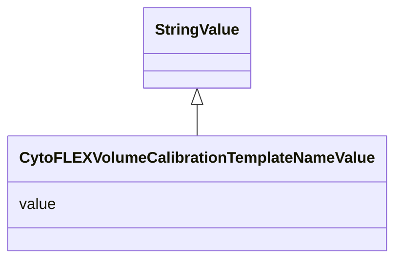

# Class: CytoFLEX Volume Calibration Template Name Value (CytoFLEXVolumeCalibrationTemplateNameValue)


_An override of StringValue specified an allowed value for the template_name for a CytoFLEX_VolumeCalibration experiment_


URI: [microbial_experiment_schema:CytoFLEXVolumeCalibrationTemplateNameValue](https://w3id.org/usnistgov/microbial-experiment-schema/CytoFLEXVolumeCalibrationTemplateNameValue)





## Inheritance
* [StringValue](StringValue.md)
    * **CytoFLEXVolumeCalibrationTemplateNameValue**


## Slots

| Name | Cardinality and Range | Description | Inheritance |
| ---  | --- | --- | --- |
| [value](value.md) | 1 <br/> [String](String.md) | The actual metadata value for an attribute | [StringValue](StringValue.md) |


## Usages

| used by | used in | type | used |
| ---  | --- | --- | --- |
| [CytoFLEXVolumeCalibration](CytoFLEXVolumeCalibration.md) | [template_name](template_name.md) | range | [CytoFLEXVolumeCalibrationTemplateNameValue](CytoFLEXVolumeCalibrationTemplateNameValue.md) |


## Identifier and Mapping Information


### Schema Source


* from schema: https://w3id.org/usnistgov/microbial-experiment-schema


## Mappings

| Mapping Type | Mapped Value |
| ---  | ---  |
| self | microbial_experiment_schema:CytoFLEXVolumeCalibrationTemplateNameValue |
| native | microbial_experiment_schema:CytoFLEXVolumeCalibrationTemplateNameValue |


## LinkML Source

<!-- TODO: investigate https://stackoverflow.com/questions/37606292/how-to-create-tabbed-code-blocks-in-mkdocs-or-sphinx -->

### Direct

<details>
```yaml
name: CytoFLEXVolumeCalibrationTemplateNameValue
description: An override of StringValue specified an allowed value for the template_name
  for a CytoFLEX_VolumeCalibration experiment
title: CytoFLEX Volume Calibration Template Name Value
from_schema: https://w3id.org/usnistgov/microbial-experiment-schema
is_a: StringValue
slot_usage:
  value:
    name: value
    range: string
    required: true
    pattern: ^CytoFLEX_VolumeCalibration$

```
</details>

### Induced

<details>
```yaml
name: CytoFLEXVolumeCalibrationTemplateNameValue
description: An override of StringValue specified an allowed value for the template_name
  for a CytoFLEX_VolumeCalibration experiment
title: CytoFLEX Volume Calibration Template Name Value
from_schema: https://w3id.org/usnistgov/microbial-experiment-schema
is_a: StringValue
slot_usage:
  value:
    name: value
    range: string
    required: true
    pattern: ^CytoFLEX_VolumeCalibration$
attributes:
  value:
    name: value
    description: The actual metadata value for an attribute
    title: value
    from_schema: https://w3id.org/usnistgov/microbial-experiment-schema
    rank: 1000
    alias: value
    owner: CytoFLEXVolumeCalibrationTemplateNameValue
    domain_of:
    - BooleanValue
    - NumberValue
    - StringValue
    - UriValue
    - DateValue
    - ArrayValue
    - ELabItemValue
    - FCInjectionModeValue
    - IncubationAtmosphereValue
    range: string
    required: true
    pattern: ^CytoFLEX_VolumeCalibration$

```
</details>