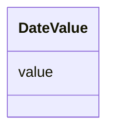

# Class: Date Value (DateValue)


_A class to hold a date value_


URI: [microbial_experiment_schema:DateValue](https://w3id.org/usnistgov/microbial-experiment-schema/DateValue)





<!-- no inheritance hierarchy -->


## Slots

| Name | Cardinality and Range | Description | Inheritance |
| ---  | --- | --- | --- |
| [value](value.md) | 1 <br/> [Date](Date.md) | The actual metadata value for an attribute | direct |


## Usages

| used by | used in | type | used |
| ---  | --- | --- | --- |
| [Experiment](Experiment.md) | [data_acquisition_date](data_acquisition_date.md) | range | [DateValue](DateValue.md) |
| [ExperimentWithData](ExperimentWithData.md) | [data_acquisition_date](data_acquisition_date.md) | range | [DateValue](DateValue.md) |
| [ExperimentWithInstrument](ExperimentWithInstrument.md) | [data_acquisition_date](data_acquisition_date.md) | range | [DateValue](DateValue.md) |
| [ExperimentWithInstrumentNoData](ExperimentWithInstrumentNoData.md) | [data_acquisition_date](data_acquisition_date.md) | range | [DateValue](DateValue.md) |
| [CytoFLEXAcquisition](CytoFLEXAcquisition.md) | [data_acquisition_date](data_acquisition_date.md) | range | [DateValue](DateValue.md) |
| [NucleicAcidExtraction](NucleicAcidExtraction.md) | [data_acquisition_date](data_acquisition_date.md) | range | [DateValue](DateValue.md) |
| [CellCultureInBroth](CellCultureInBroth.md) | [data_acquisition_date](data_acquisition_date.md) | range | [DateValue](DateValue.md) |
| [CytoFLEXVolumeCalibration](CytoFLEXVolumeCalibration.md) | [data_acquisition_date](data_acquisition_date.md) | range | [DateValue](DateValue.md) |
| [GenericTemplateDeprecated](GenericTemplateDeprecated.md) | [labcas_data_acquisition_date](labcas_data_acquisition_date.md) | range | [DateValue](DateValue.md) |
| [GenericTemplateDeprecated](GenericTemplateDeprecated.md) | [data_acquisition_date](data_acquisition_date.md) | range | [DateValue](DateValue.md) |
| [FormaldehydeFixation](FormaldehydeFixation.md) | [data_acquisition_date](data_acquisition_date.md) | range | [DateValue](DateValue.md) |
| [MicroscopyAcquisition](MicroscopyAcquisition.md) | [data_acquisition_date](data_acquisition_date.md) | range | [DateValue](DateValue.md) |
| [GenericTemplate](GenericTemplate.md) | [data_acquisition_date](data_acquisition_date.md) | range | [DateValue](DateValue.md) |
| [CoulterAcquisition](CoulterAcquisition.md) | [data_acquisition_date](data_acquisition_date.md) | range | [DateValue](DateValue.md) |
| [BactoBoxAcquisition](BactoBoxAcquisition.md) | [data_acquisition_date](data_acquisition_date.md) | range | [DateValue](DateValue.md) |
| [LogCOMETSamplePrep](LogCOMETSamplePrep.md) | [data_acquisition_date](data_acquisition_date.md) | range | [DateValue](DateValue.md) |
| [CFU](CFU.md) | [data_acquisition_date](data_acquisition_date.md) | range | [DateValue](DateValue.md) |
| [DifcoAmendedSporulationAgarProtocol](DifcoAmendedSporulationAgarProtocol.md) | [data_acquisition_date](data_acquisition_date.md) | range | [DateValue](DateValue.md) |
| [InitiateGrowthOfBSpizizenii](InitiateGrowthOfBSpizizenii.md) | [data_acquisition_date](data_acquisition_date.md) | range | [DateValue](DateValue.md) |
| [SlideCleaning](SlideCleaning.md) | [data_acquisition_date](data_acquisition_date.md) | range | [DateValue](DateValue.md) |


## Identifier and Mapping Information


### Schema Source


* from schema: https://w3id.org/usnistgov/microbial-experiment-schema


## Mappings

| Mapping Type | Mapped Value |
| ---  | ---  |
| self | microbial_experiment_schema:DateValue |
| native | microbial_experiment_schema:DateValue |


## LinkML Source

<!-- TODO: investigate https://stackoverflow.com/questions/37606292/how-to-create-tabbed-code-blocks-in-mkdocs-or-sphinx -->

### Direct

<details>
```yaml
name: DateValue
description: A class to hold a date value
title: Date Value
from_schema: https://w3id.org/usnistgov/microbial-experiment-schema
slots:
- value
slot_usage:
  value:
    name: value
    range: date

```
</details>

### Induced

<details>
```yaml
name: DateValue
description: A class to hold a date value
title: Date Value
from_schema: https://w3id.org/usnistgov/microbial-experiment-schema
slot_usage:
  value:
    name: value
    range: date
attributes:
  value:
    name: value
    description: The actual metadata value for an attribute
    title: value
    from_schema: https://w3id.org/usnistgov/microbial-experiment-schema
    rank: 1000
    alias: value
    owner: DateValue
    domain_of:
    - BooleanValue
    - NumberValue
    - StringValue
    - UriValue
    - DateValue
    - ArrayValue
    - ELabItemValue
    - FCInjectionModeValue
    - IncubationAtmosphereValue
    range: date
    required: true

```
</details>