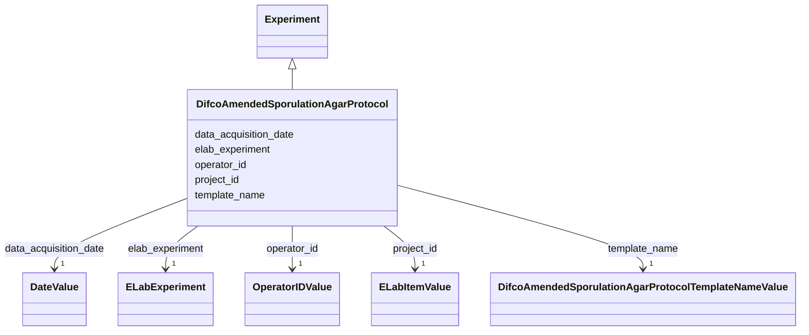

# Class: Difco Amended Sporulation Agar (ASA) Protocol (DifcoAmendedSporulationAgarProtocol)


_Metadata describing the preparation process for amended sporulation agar_


URI: [microbial_experiment_schema:DifcoAmendedSporulationAgarProtocol](https://w3id.org/usnistgov/microbial-experiment-schema/DifcoAmendedSporulationAgarProtocol)





## Inheritance
* [Experiment](Experiment.md)
    * **DifcoAmendedSporulationAgarProtocol**


## Slots

| Name | Cardinality and Range | Description | Inheritance |
| ---  | --- | --- | --- |
| [data_acquisition_date](data_acquisition_date.md) | 1 <br/> [DateValue](DateValue.md) | Date on which data were acquired according to eLabFTW record | [Experiment](Experiment.md) |
| [elab_experiment](elab_experiment.md) | 1 <br/> [ELabExperiment](ELabExperiment.md) | A self-reference to this experiment record | [Experiment](Experiment.md) |
| [operator_id](operator_id.md) | 1 <br/> [OperatorIDValue](OperatorIDValue.md) | Instrument operator during an experiment (a linked item from ELabFTW) | [Experiment](Experiment.md) |
| [project_id](project_id.md) | 1 <br/> [ELabItemValue](ELabItemValue.md) | The project that an experiment supports (link to an ELabFTW item) | [Experiment](Experiment.md) |
| [template_name](template_name.md) | 1 <br/> [DifcoAmendedSporulationAgarProtocolTemplateNameValue](DifcoAmendedSporulationAgarProtocolTemplateNameValue.md) | The name of the template used to collect metadata for an experiment in ELabFT... | [Experiment](Experiment.md) |


## Identifier and Mapping Information


### Annotations

| property | value |
| --- | --- |
| elabftw_template | True |


### Schema Source


* from schema: https://w3id.org/usnistgov/microbial-experiment-schema


## Mappings

| Mapping Type | Mapped Value |
| ---  | ---  |
| self | microbial_experiment_schema:DifcoAmendedSporulationAgarProtocol |
| native | microbial_experiment_schema:DifcoAmendedSporulationAgarProtocol |


## LinkML Source

<!-- TODO: investigate https://stackoverflow.com/questions/37606292/how-to-create-tabbed-code-blocks-in-mkdocs-or-sphinx -->

### Direct

<details>
```yaml
name: DifcoAmendedSporulationAgarProtocol
annotations:
  elabftw_template:
    tag: elabftw_template
    value: true
description: Metadata describing the preparation process for amended sporulation agar
title: Difco Amended Sporulation Agar (ASA) Protocol
from_schema: https://w3id.org/usnistgov/microbial-experiment-schema
is_a: Experiment
slot_usage:
  template_name:
    name: template_name
    range: DifcoAmendedSporulationAgarProtocolTemplateNameValue

```
</details>

### Induced

<details>
```yaml
name: DifcoAmendedSporulationAgarProtocol
annotations:
  elabftw_template:
    tag: elabftw_template
    value: true
description: Metadata describing the preparation process for amended sporulation agar
title: Difco Amended Sporulation Agar (ASA) Protocol
from_schema: https://w3id.org/usnistgov/microbial-experiment-schema
is_a: Experiment
slot_usage:
  template_name:
    name: template_name
    range: DifcoAmendedSporulationAgarProtocolTemplateNameValue
attributes:
  data_acquisition_date:
    name: data_acquisition_date
    annotations:
      elabftw_group:
        tag: elabftw_group
        value: LabCAS
      elabftw_user_input:
        tag: elabftw_user_input
        value: true
    description: Date on which data were acquired according to eLabFTW record
    title: DataAcquisitionDate
    from_schema: https://w3id.org/usnistgov/microbial-experiment-schema
    rank: 1000
    alias: data_acquisition_date
    owner: DifcoAmendedSporulationAgarProtocol
    domain_of:
    - Experiment
    range: DateValue
    required: true
  elab_experiment:
    name: elab_experiment
    annotations:
      elabftw_user_input:
        tag: elabftw_user_input
        value: false
    description: A self-reference to this experiment record
    title: ELabFTW Experiment
    from_schema: https://w3id.org/usnistgov/microbial-experiment-schema
    rank: 1000
    alias: elab_experiment
    owner: DifcoAmendedSporulationAgarProtocol
    domain_of:
    - Experiment
    range: ELabExperiment
    required: true
    inlined: true
    inlined_as_list: true
  operator_id:
    name: operator_id
    annotations:
      elabftw_group:
        tag: elabftw_group
        value: LabCAS
      elabftw_user_input:
        tag: elabftw_user_input
        value: true
    description: Instrument operator during an experiment (a linked item from ELabFTW)
    title: OperatorID
    from_schema: https://w3id.org/usnistgov/microbial-experiment-schema
    rank: 1000
    alias: operator_id
    owner: DifcoAmendedSporulationAgarProtocol
    domain_of:
    - Experiment
    range: OperatorIDValue
    required: true
  project_id:
    name: project_id
    annotations:
      elabftw_group:
        tag: elabftw_group
        value: LabCAS
      elabftw_user_input:
        tag: elabftw_user_input
        value: true
    description: The project that an experiment supports (link to an ELabFTW item)
    title: ProjectID
    from_schema: https://w3id.org/usnistgov/microbial-experiment-schema
    rank: 1000
    alias: project_id
    owner: DifcoAmendedSporulationAgarProtocol
    domain_of:
    - Experiment
    range: ELabItemValue
    required: true
  template_name:
    name: template_name
    annotations:
      elabftw_group:
        tag: elabftw_group
        value: LabCAS
      read_only:
        tag: read_only
        value: true
      elabftw_user_input:
        tag: elabftw_user_input
        value: true
    description: The name of the template used to collect metadata for an experiment
      in ELabFTW. This value controls what specific metadata fields are allowed.
    title: TemplateName
    from_schema: https://w3id.org/usnistgov/microbial-experiment-schema
    rank: 1000
    alias: template_name
    owner: DifcoAmendedSporulationAgarProtocol
    domain_of:
    - Experiment
    range: DifcoAmendedSporulationAgarProtocolTemplateNameValue
    required: true

```
</details>