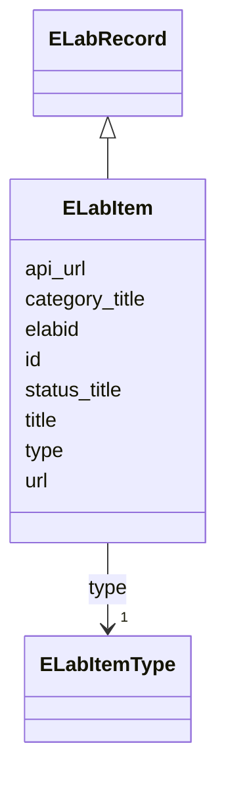

# Class: ELabFTW Item (ELabItem)


_A class to hold metadata sufficient to reference a resource (database item) record in an ELabFTW instance._


URI: [microbial_experiment_schema:ELabItem](https://w3id.org/usnistgov/microbial-experiment-schema/ELabItem)





## Inheritance
* [ELabRecord](ELabRecord.md)
    * **ELabItem**


## Slots

| Name | Cardinality and Range | Description | Inheritance |
| ---  | --- | --- | --- |
| [type](type.md) | 1 <br/> [ELabItemType](ELabItemType.md) | Whether this item is a resource (database item) or an experiment | direct |
| [status_title](status_title.md) | 0..1 <br/> [String](String.md) | The status title of an ELabFTW resource | [ELabRecord](ELabRecord.md) |
| [id](id.md) | 1 <br/> [Integer](Integer.md) | The integer identifier for this item used by this eLabFTW instance | [ELabRecord](ELabRecord.md) |
| [elabid](elabid.md) | 1 <br/> [String](String.md) | The unique "eLabID" for this item | [ELabRecord](ELabRecord.md) |
| [url](url.md) | 1 <br/> [Uri](Uri.md) | A (resolvable) URL for accessing this item via a web browser | [ELabRecord](ELabRecord.md) |
| [api_url](api_url.md) | 1 <br/> [Uri](Uri.md) | A URL for accessing this item via the eLabFTW API | [ELabRecord](ELabRecord.md) |
| [title](title.md) | 1 <br/> [String](String.md) | A short description of this item | [ELabRecord](ELabRecord.md) |
| [category_title](category_title.md) | 1 <br/> [String](String.md) | The name of the category for this item (called an "item type") in eLabFTW | [ELabRecord](ELabRecord.md) |


## Usages

| used by | used in | type | used |
| ---  | --- | --- | --- |
| [ELabItemValue](ELabItemValue.md) | [value](value.md) | range | [ELabItem](ELabItem.md) |
| [FluorescentProbeValue](FluorescentProbeValue.md) | [value](value.md) | range | [ELabItem](ELabItem.md) |
| [InstrumentIDValue](InstrumentIDValue.md) | [value](value.md) | range | [ELabItem](ELabItem.md) |
| [LabCASInstrumentValue](LabCASInstrumentValue.md) | [value](value.md) | range | [ELabItem](ELabItem.md) |
| [LabCASMicrobialMaterialIDValue](LabCASMicrobialMaterialIDValue.md) | [value](value.md) | range | [ELabItem](ELabItem.md) |
| [LabCASOperatorValue](LabCASOperatorValue.md) | [value](value.md) | range | [ELabItem](ELabItem.md) |
| [LabCASProjectValue](LabCASProjectValue.md) | [value](value.md) | range | [ELabItem](ELabItem.md) |
| [MicrobialMaterialIDValue](MicrobialMaterialIDValue.md) | [value](value.md) | range | [ELabItem](ELabItem.md) |
| [OperatorIDValue](OperatorIDValue.md) | [value](value.md) | range | [ELabItem](ELabItem.md) |
| [ProjectIDValue](ProjectIDValue.md) | [value](value.md) | range | [ELabItem](ELabItem.md) |


## Identifier and Mapping Information


### Schema Source


* from schema: https://w3id.org/usnistgov/microbial-experiment-schema


## Mappings

| Mapping Type | Mapped Value |
| ---  | ---  |
| self | microbial_experiment_schema:ELabItem |
| native | microbial_experiment_schema:ELabItem |


## LinkML Source

<!-- TODO: investigate https://stackoverflow.com/questions/37606292/how-to-create-tabbed-code-blocks-in-mkdocs-or-sphinx -->

### Direct

<details>
```yaml
name: ELabItem
description: A class to hold metadata sufficient to reference a resource (database
  item) record in an ELabFTW instance.
title: ELabFTW Item
from_schema: https://w3id.org/usnistgov/microbial-experiment-schema
is_a: ELabRecord
slot_usage:
  status_title:
    name: status_title
    required: false
attributes:
  type:
    name: type
    description: Whether this item is a resource (database item) or an experiment
    title: Type
    from_schema: https://w3id.org/usnistgov/microbial-experiment-schema
    rank: 1000
    domain_of:
    - ELabItem
    - ELabExperiment
    range: ELabItemType
    required: true

```
</details>

### Induced

<details>
```yaml
name: ELabItem
description: A class to hold metadata sufficient to reference a resource (database
  item) record in an ELabFTW instance.
title: ELabFTW Item
from_schema: https://w3id.org/usnistgov/microbial-experiment-schema
is_a: ELabRecord
slot_usage:
  status_title:
    name: status_title
    required: false
attributes:
  type:
    name: type
    description: Whether this item is a resource (database item) or an experiment
    title: Type
    from_schema: https://w3id.org/usnistgov/microbial-experiment-schema
    rank: 1000
    alias: type
    owner: ELabItem
    domain_of:
    - ELabItem
    - ELabExperiment
    range: ELabItemType
    required: true
  status_title:
    name: status_title
    description: The status title of an ELabFTW resource
    title: StatusTitle
    from_schema: https://w3id.org/usnistgov/microbial-experiment-schema
    rank: 1000
    alias: status_title
    owner: ELabItem
    domain_of:
    - ELabRecord
    range: string
    required: false
  id:
    name: id
    description: The integer identifier for this item used by this eLabFTW instance
    title: id
    from_schema: https://w3id.org/usnistgov/microbial-experiment-schema
    rank: 1000
    identifier: true
    alias: id
    owner: ELabItem
    domain_of:
    - ELabRecord
    range: integer
    required: true
  elabid:
    name: elabid
    description: The unique "eLabID" for this item
    title: eLabID
    from_schema: https://w3id.org/usnistgov/microbial-experiment-schema
    rank: 1000
    alias: elabid
    owner: ELabItem
    domain_of:
    - ELabRecord
    range: string
    required: true
  url:
    name: url
    description: A (resolvable) URL for accessing this item via a web browser
    title: url
    from_schema: https://w3id.org/usnistgov/microbial-experiment-schema
    rank: 1000
    alias: url
    owner: ELabItem
    domain_of:
    - ELabRecord
    range: uri
    required: true
  api_url:
    name: api_url
    description: A URL for accessing this item via the eLabFTW API
    title: API url
    from_schema: https://w3id.org/usnistgov/microbial-experiment-schema
    rank: 1000
    alias: api_url
    owner: ELabItem
    domain_of:
    - ELabRecord
    range: uri
    required: true
  title:
    name: title
    description: A short description of this item
    title: Title
    from_schema: https://w3id.org/usnistgov/microbial-experiment-schema
    rank: 1000
    alias: title
    owner: ELabItem
    domain_of:
    - ELabRecord
    range: string
    required: true
  category_title:
    name: category_title
    description: The name of the category for this item (called an "item type") in
      eLabFTW
    title: Category Title
    from_schema: https://w3id.org/usnistgov/microbial-experiment-schema
    rank: 1000
    alias: category_title
    owner: ELabItem
    domain_of:
    - ELabRecord
    range: string
    required: true

```
</details>