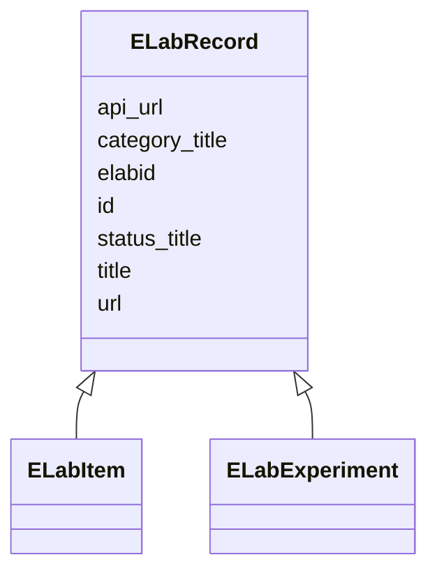

# Class: ELabFTW Record (ELabRecord) <span style="color: pink;"><strong><small> (Abstract) </small></strong></span> 


_An abstract data type representing a link to an record (experiment or resource/item) in an eLabFTW instance. Use one of the ELabItem or ELabRecord classes that implement this one rather than using it directly._


* __NOTE__: this is an abstract class and should not be instantiated directly


URI: [microbial_experiment_schema:ELabRecord](https://w3id.org/usnistgov/microbial-experiment-schema/ELabRecord)





## Inheritance
* **ELabRecord**
    * [ELabItem](ELabItem.md)
    * [ELabExperiment](ELabExperiment.md)


## Slots

| Name | Cardinality and Range | Description | Inheritance |
| ---  | --- | --- | --- |
| [status_title](status_title.md) | 1 <br/> [String](String.md) | The status title of an ELabFTW resource | direct |
| [id](id.md) | 1 <br/> [Integer](Integer.md) | The integer identifier for this item used by this eLabFTW instance | direct |
| [elabid](elabid.md) | 1 <br/> [String](String.md) | The unique "eLabID" for this item | direct |
| [url](url.md) | 1 <br/> [Uri](Uri.md) | A (resolvable) URL for accessing this item via a web browser | direct |
| [api_url](api_url.md) | 1 <br/> [Uri](Uri.md) | A URL for accessing this item via the eLabFTW API | direct |
| [title](title.md) | 1 <br/> [String](String.md) | A short description of this item | direct |
| [category_title](category_title.md) | 1 <br/> [String](String.md) | The name of the category for this item (called an "item type") in eLabFTW | direct |


## Identifier and Mapping Information


### Schema Source


* from schema: https://w3id.org/usnistgov/microbial-experiment-schema


## Mappings

| Mapping Type | Mapped Value |
| ---  | ---  |
| self | microbial_experiment_schema:ELabRecord |
| native | microbial_experiment_schema:ELabRecord |


## LinkML Source

<!-- TODO: investigate https://stackoverflow.com/questions/37606292/how-to-create-tabbed-code-blocks-in-mkdocs-or-sphinx -->

### Direct

<details>
```yaml
name: ELabRecord
description: An abstract data type representing a link to an record (experiment or
  resource/item) in an eLabFTW instance. Use one of the ELabItem or ELabRecord classes
  that implement this one rather than using it directly.
title: ELabFTW Record
from_schema: https://w3id.org/usnistgov/microbial-experiment-schema
abstract: true
slots:
- status_title
attributes:
  id:
    name: id
    description: The integer identifier for this item used by this eLabFTW instance
    title: id
    from_schema: https://w3id.org/usnistgov/microbial-experiment-schema
    rank: 1000
    identifier: true
    domain_of:
    - ELabRecord
    range: integer
    required: true
  elabid:
    name: elabid
    description: The unique "eLabID" for this item
    title: eLabID
    from_schema: https://w3id.org/usnistgov/microbial-experiment-schema
    rank: 1000
    domain_of:
    - ELabRecord
    range: string
    required: true
  url:
    name: url
    description: A (resolvable) URL for accessing this item via a web browser
    title: url
    from_schema: https://w3id.org/usnistgov/microbial-experiment-schema
    rank: 1000
    domain_of:
    - ELabRecord
    range: uri
    required: true
  api_url:
    name: api_url
    description: A URL for accessing this item via the eLabFTW API
    title: API url
    from_schema: https://w3id.org/usnistgov/microbial-experiment-schema
    rank: 1000
    domain_of:
    - ELabRecord
    range: uri
    required: true
  title:
    name: title
    description: A short description of this item
    title: Title
    from_schema: https://w3id.org/usnistgov/microbial-experiment-schema
    rank: 1000
    domain_of:
    - ELabRecord
    range: string
    required: true
  category_title:
    name: category_title
    description: The name of the category for this item (called an "item type") in
      eLabFTW
    title: Category Title
    from_schema: https://w3id.org/usnistgov/microbial-experiment-schema
    rank: 1000
    domain_of:
    - ELabRecord
    required: true

```
</details>

### Induced

<details>
```yaml
name: ELabRecord
description: An abstract data type representing a link to an record (experiment or
  resource/item) in an eLabFTW instance. Use one of the ELabItem or ELabRecord classes
  that implement this one rather than using it directly.
title: ELabFTW Record
from_schema: https://w3id.org/usnistgov/microbial-experiment-schema
abstract: true
attributes:
  id:
    name: id
    description: The integer identifier for this item used by this eLabFTW instance
    title: id
    from_schema: https://w3id.org/usnistgov/microbial-experiment-schema
    rank: 1000
    identifier: true
    alias: id
    owner: ELabRecord
    domain_of:
    - ELabRecord
    range: integer
    required: true
  elabid:
    name: elabid
    description: The unique "eLabID" for this item
    title: eLabID
    from_schema: https://w3id.org/usnistgov/microbial-experiment-schema
    rank: 1000
    alias: elabid
    owner: ELabRecord
    domain_of:
    - ELabRecord
    range: string
    required: true
  url:
    name: url
    description: A (resolvable) URL for accessing this item via a web browser
    title: url
    from_schema: https://w3id.org/usnistgov/microbial-experiment-schema
    rank: 1000
    alias: url
    owner: ELabRecord
    domain_of:
    - ELabRecord
    range: uri
    required: true
  api_url:
    name: api_url
    description: A URL for accessing this item via the eLabFTW API
    title: API url
    from_schema: https://w3id.org/usnistgov/microbial-experiment-schema
    rank: 1000
    alias: api_url
    owner: ELabRecord
    domain_of:
    - ELabRecord
    range: uri
    required: true
  title:
    name: title
    description: A short description of this item
    title: Title
    from_schema: https://w3id.org/usnistgov/microbial-experiment-schema
    rank: 1000
    alias: title
    owner: ELabRecord
    domain_of:
    - ELabRecord
    range: string
    required: true
  category_title:
    name: category_title
    description: The name of the category for this item (called an "item type") in
      eLabFTW
    title: Category Title
    from_schema: https://w3id.org/usnistgov/microbial-experiment-schema
    rank: 1000
    alias: category_title
    owner: ELabRecord
    domain_of:
    - ELabRecord
    range: string
    required: true
  status_title:
    name: status_title
    description: The status title of an ELabFTW resource
    title: StatusTitle
    from_schema: https://w3id.org/usnistgov/microbial-experiment-schema
    rank: 1000
    alias: status_title
    owner: ELabRecord
    domain_of:
    - ELabRecord
    range: string
    required: true

```
</details>