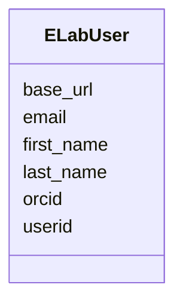

# Class: ELabFTW User (ELabUser)


_A data type representing a link to a user in an eLabFTW instance_


URI: [microbial_experiment_schema:ELabUser](https://w3id.org/usnistgov/microbial-experiment-schema/ELabUser)





<!-- no inheritance hierarchy -->


## Slots

| Name | Cardinality and Range | Description | Inheritance |
| ---  | --- | --- | --- |
| [userid](userid.md) | 1 <br/> [Integer](Integer.md) | The "local" identifier number for this user in the eLabFTW instance | direct |
| [first_name](first_name.md) | 1 <br/> [String](String.md) | The user's first (given) name | direct |
| [last_name](last_name.md) | 1 <br/> [String](String.md) | The user's last name (surname) | direct |
| [email](email.md) | 1 <br/> [String](String.md) | The user's email address | direct |
| [base_url](base_url.md) | 1 <br/> [Uri](Uri.md) | The URL of the ELabFTW instance in which the user is registered | direct |
| [orcid](orcid.md) | 0..1 <br/> [String](String.md) | The user's ORCID (if defined) | direct |


## Identifier and Mapping Information


### Schema Source


* from schema: https://w3id.org/usnistgov/microbial-experiment-schema


## Mappings

| Mapping Type | Mapped Value |
| ---  | ---  |
| self | microbial_experiment_schema:ELabUser |
| native | microbial_experiment_schema:ELabUser |


## LinkML Source

<!-- TODO: investigate https://stackoverflow.com/questions/37606292/how-to-create-tabbed-code-blocks-in-mkdocs-or-sphinx -->

### Direct

<details>
```yaml
name: ELabUser
description: A data type representing a link to a user in an eLabFTW instance
title: ELabFTW User
from_schema: https://w3id.org/usnistgov/microbial-experiment-schema
attributes:
  userid:
    name: userid
    description: The "local" identifier number for this user in the eLabFTW instance
    title: User ID
    from_schema: https://w3id.org/usnistgov/microbial-experiment-schema
    rank: 1000
    identifier: true
    domain_of:
    - ELabUser
    range: integer
    required: true
  first_name:
    name: first_name
    description: The user's first (given) name
    title: First Name
    from_schema: https://w3id.org/usnistgov/microbial-experiment-schema
    rank: 1000
    domain_of:
    - ELabUser
    required: true
  last_name:
    name: last_name
    description: The user's last name (surname)
    title: Last Name
    from_schema: https://w3id.org/usnistgov/microbial-experiment-schema
    rank: 1000
    domain_of:
    - ELabUser
    required: true
  email:
    name: email
    description: The user's email address
    title: Email
    from_schema: https://w3id.org/usnistgov/microbial-experiment-schema
    rank: 1000
    domain_of:
    - ELabUser
    required: true
    pattern: ^\S+@[\S+\.]+\S+
  base_url:
    name: base_url
    description: The URL of the ELabFTW instance in which the user is registered
    title: ELabFTW Base URL
    from_schema: https://w3id.org/usnistgov/microbial-experiment-schema
    rank: 1000
    domain_of:
    - ELabUser
    range: uri
    required: true
  orcid:
    name: orcid
    description: The user's ORCID (if defined)
    title: ORCID
    from_schema: https://w3id.org/usnistgov/microbial-experiment-schema
    rank: 1000
    domain_of:
    - ELabUser
    range: string
    required: false
    pattern: ^\d{4}-\d{4}-\d{4}-\d{3}(\d|X)$

```
</details>

### Induced

<details>
```yaml
name: ELabUser
description: A data type representing a link to a user in an eLabFTW instance
title: ELabFTW User
from_schema: https://w3id.org/usnistgov/microbial-experiment-schema
attributes:
  userid:
    name: userid
    description: The "local" identifier number for this user in the eLabFTW instance
    title: User ID
    from_schema: https://w3id.org/usnistgov/microbial-experiment-schema
    rank: 1000
    identifier: true
    alias: userid
    owner: ELabUser
    domain_of:
    - ELabUser
    range: integer
    required: true
  first_name:
    name: first_name
    description: The user's first (given) name
    title: First Name
    from_schema: https://w3id.org/usnistgov/microbial-experiment-schema
    rank: 1000
    alias: first_name
    owner: ELabUser
    domain_of:
    - ELabUser
    range: string
    required: true
  last_name:
    name: last_name
    description: The user's last name (surname)
    title: Last Name
    from_schema: https://w3id.org/usnistgov/microbial-experiment-schema
    rank: 1000
    alias: last_name
    owner: ELabUser
    domain_of:
    - ELabUser
    range: string
    required: true
  email:
    name: email
    description: The user's email address
    title: Email
    from_schema: https://w3id.org/usnistgov/microbial-experiment-schema
    rank: 1000
    alias: email
    owner: ELabUser
    domain_of:
    - ELabUser
    range: string
    required: true
    pattern: ^\S+@[\S+\.]+\S+
  base_url:
    name: base_url
    description: The URL of the ELabFTW instance in which the user is registered
    title: ELabFTW Base URL
    from_schema: https://w3id.org/usnistgov/microbial-experiment-schema
    rank: 1000
    alias: base_url
    owner: ELabUser
    domain_of:
    - ELabUser
    range: uri
    required: true
  orcid:
    name: orcid
    description: The user's ORCID (if defined)
    title: ORCID
    from_schema: https://w3id.org/usnistgov/microbial-experiment-schema
    rank: 1000
    alias: orcid
    owner: ELabUser
    domain_of:
    - ELabUser
    range: string
    required: false
    pattern: ^\d{4}-\d{4}-\d{4}-\d{3}(\d|X)$

```
</details>