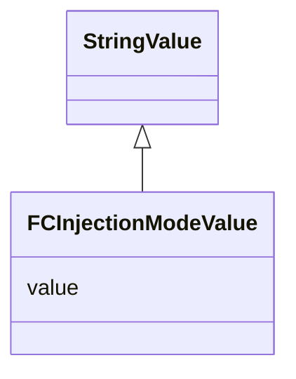

# Class: Flow Cytometry Injection Mode Value (FCInjectionModeValue)


_An override of StringValue allowing only values from the FCInjectionModeEnum enum_


URI: [microbial_experiment_schema:FCInjectionModeValue](https://w3id.org/usnistgov/microbial-experiment-schema/FCInjectionModeValue)





## Inheritance
* [StringValue](StringValue.md)
    * **FCInjectionModeValue**


## Slots

| Name | Cardinality and Range | Description | Inheritance |
| ---  | --- | --- | --- |
| [value](value.md) | 0..1 <br/> [String](String.md) | The value attribute for FCInjectionMode | direct |


## Usages

| used by | used in | type | used |
| ---  | --- | --- | --- |
| [CytoFLEXAcquisition](CytoFLEXAcquisition.md) | [fc_injection_mode](fc_injection_mode.md) | range | [FCInjectionModeValue](FCInjectionModeValue.md) |
| [CytoFLEXVolumeCalibration](CytoFLEXVolumeCalibration.md) | [fc_injection_mode](fc_injection_mode.md) | range | [FCInjectionModeValue](FCInjectionModeValue.md) |
| [GenericTemplateDeprecated](GenericTemplateDeprecated.md) | [fc_injection_mode](fc_injection_mode.md) | range | [FCInjectionModeValue](FCInjectionModeValue.md) |
| [GenericTemplate](GenericTemplate.md) | [fc_injection_mode](fc_injection_mode.md) | range | [FCInjectionModeValue](FCInjectionModeValue.md) |


## Identifier and Mapping Information


### Schema Source


* from schema: https://w3id.org/usnistgov/microbial-experiment-schema


## Mappings

| Mapping Type | Mapped Value |
| ---  | ---  |
| self | microbial_experiment_schema:FCInjectionModeValue |
| native | microbial_experiment_schema:FCInjectionModeValue |


## LinkML Source

<!-- TODO: investigate https://stackoverflow.com/questions/37606292/how-to-create-tabbed-code-blocks-in-mkdocs-or-sphinx -->

### Direct

<details>
```yaml
name: FCInjectionModeValue
description: An override of StringValue allowing only values from the FCInjectionModeEnum
  enum
title: Flow Cytometry Injection Mode Value
from_schema: https://w3id.org/usnistgov/microbial-experiment-schema
is_a: StringValue
attributes:
  value:
    name: value
    description: The value attribute for FCInjectionMode
    from_schema: https://w3id.org/usnistgov/microbial-experiment-schema
    domain_of:
    - BooleanValue
    - NumberValue
    - StringValue
    - UriValue
    - DateValue
    - ArrayValue
    - ELabItemValue
    - FCInjectionModeValue
    - IncubationAtmosphereValue
    range: FCInjectionModeEnum

```
</details>

### Induced

<details>
```yaml
name: FCInjectionModeValue
description: An override of StringValue allowing only values from the FCInjectionModeEnum
  enum
title: Flow Cytometry Injection Mode Value
from_schema: https://w3id.org/usnistgov/microbial-experiment-schema
is_a: StringValue
attributes:
  value:
    name: value
    description: The value attribute for FCInjectionMode
    from_schema: https://w3id.org/usnistgov/microbial-experiment-schema
    alias: value
    owner: FCInjectionModeValue
    domain_of:
    - BooleanValue
    - NumberValue
    - StringValue
    - UriValue
    - DateValue
    - ArrayValue
    - ELabItemValue
    - FCInjectionModeValue
    - IncubationAtmosphereValue
    range: string

```
</details>