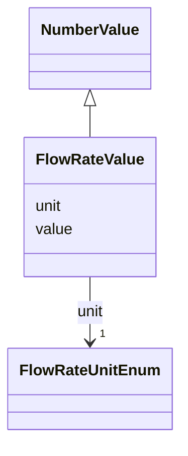

# Class: Flow Rate Value (FlowRateValue)


_A class to hold a numerical value representing a flow rate measurement_


URI: [microbial_experiment_schema:FlowRateValue](https://w3id.org/usnistgov/microbial-experiment-schema/FlowRateValue)





## Inheritance
* [NumberValue](NumberValue.md)
    * **FlowRateValue**


## Slots

| Name | Cardinality and Range | Description | Inheritance |
| ---  | --- | --- | --- |
| [value](value.md) | 1 <br/> [Decimal](Decimal.md) | The actual metadata value for an attribute | [NumberValue](NumberValue.md) |
| [unit](unit.md) | 1 <br/> [FlowRateUnitEnum](FlowRateUnitEnum.md) | The flow rate unit corresponding to a metadata value | [NumberValue](NumberValue.md) |


## Usages

| used by | used in | type | used |
| ---  | --- | --- | --- |
| [CytoFLEXAcquisition](CytoFLEXAcquisition.md) | [fc_flow_rate_setting](fc_flow_rate_setting.md) | range | [FlowRateValue](FlowRateValue.md) |
| [CytoFLEXVolumeCalibration](CytoFLEXVolumeCalibration.md) | [fc_flow_rate_setting](fc_flow_rate_setting.md) | range | [FlowRateValue](FlowRateValue.md) |
| [GenericTemplateDeprecated](GenericTemplateDeprecated.md) | [fc_flow_rate_setting](fc_flow_rate_setting.md) | range | [FlowRateValue](FlowRateValue.md) |
| [GenericTemplate](GenericTemplate.md) | [fc_flow_rate_setting](fc_flow_rate_setting.md) | range | [FlowRateValue](FlowRateValue.md) |


## Identifier and Mapping Information


### Schema Source


* from schema: https://w3id.org/usnistgov/microbial-experiment-schema


## Mappings

| Mapping Type | Mapped Value |
| ---  | ---  |
| self | microbial_experiment_schema:FlowRateValue |
| native | microbial_experiment_schema:FlowRateValue |


## LinkML Source

<!-- TODO: investigate https://stackoverflow.com/questions/37606292/how-to-create-tabbed-code-blocks-in-mkdocs-or-sphinx -->

### Direct

<details>
```yaml
name: FlowRateValue
description: A class to hold a numerical value representing a flow rate measurement
title: Flow Rate Value
from_schema: https://w3id.org/usnistgov/microbial-experiment-schema
is_a: NumberValue
slot_usage:
  unit:
    name: unit
    description: The flow rate unit corresponding to a metadata value
    range: FlowRateUnitEnum
    required: true

```
</details>

### Induced

<details>
```yaml
name: FlowRateValue
description: A class to hold a numerical value representing a flow rate measurement
title: Flow Rate Value
from_schema: https://w3id.org/usnistgov/microbial-experiment-schema
is_a: NumberValue
slot_usage:
  unit:
    name: unit
    description: The flow rate unit corresponding to a metadata value
    range: FlowRateUnitEnum
    required: true
attributes:
  value:
    name: value
    description: The actual metadata value for an attribute
    title: value
    from_schema: https://w3id.org/usnistgov/microbial-experiment-schema
    rank: 1000
    alias: value
    owner: FlowRateValue
    domain_of:
    - BooleanValue
    - NumberValue
    - StringValue
    - UriValue
    - DateValue
    - ArrayValue
    - ELabItemValue
    - FCInjectionModeValue
    - IncubationAtmosphereValue
    range: decimal
    required: true
  unit:
    name: unit
    description: The flow rate unit corresponding to a metadata value
    title: unit
    from_schema: https://w3id.org/usnistgov/microbial-experiment-schema
    rank: 1000
    alias: unit
    owner: FlowRateValue
    domain_of:
    - NumberValue
    range: FlowRateUnitEnum
    required: true

```
</details>