# Class: ~~GenericTemplate_Deprecated (GenericTemplateDeprecated)~~<span style="color: #ff5252;"><strong> (DEPRECATED) </strong></span> <span style="color: pink;"><strong><small> (Abstract) </small></strong></span> 


_A retired version of a generic experiment template used to create other templates_


* __NOTE__: this is an abstract class and should not be instantiated directly


* __NOTE__ this element has been deprecated with the following note:
    * *(2024 June) this is no longer used, use GenericTemplate instead*
    * Element has been replaced by [GenericTemplate](GenericTemplate.md)


URI: [microbial_experiment_schema:GenericTemplateDeprecated](https://w3id.org/usnistgov/microbial-experiment-schema/GenericTemplateDeprecated)

```mermaid
 classDiagram
    class GenericTemplateDeprecated
    click GenericTemplateDeprecated href "../GenericTemplateDeprecated"
      ExperimentWithInstrument <|-- GenericTemplateDeprecated
        click ExperimentWithInstrument href "../ExperimentWithInstrument"
      
      GenericTemplateDeprecated : acquisition_time
        
          
    
    
    GenericTemplateDeprecated --> "0..1" DurationValue : acquisition_time
    click DurationValue href "../DurationValue"

        
      GenericTemplateDeprecated : acquisition_volume
        
          
    
    
    GenericTemplateDeprecated --> "0..1" VolumeValue : acquisition_volume
    click VolumeValue href "../VolumeValue"

        
      GenericTemplateDeprecated : bead_lot_number_concentration_qc
        
          
    
    
    GenericTemplateDeprecated --> "0..1" StringValue : bead_lot_number_concentration_qc
    click StringValue href "../StringValue"

        
      GenericTemplateDeprecated : bead_lot_number_size_qc
        
          
    
    
    GenericTemplateDeprecated --> "0..1" StringValue : bead_lot_number_size_qc
    click StringValue href "../StringValue"

        
      GenericTemplateDeprecated : cell_volume
        
          
    
    
    GenericTemplateDeprecated --> "0..1" VolumeValue : cell_volume
    click VolumeValue href "../VolumeValue"

        
      GenericTemplateDeprecated : cfu_method
        
          
    
    
    GenericTemplateDeprecated --> "0..1" CFUMethodValue : cfu_method
    click CFUMethodValue href "../CFUMethodValue"

        
      GenericTemplateDeprecated : core_data_path
        
          
    
    
    GenericTemplateDeprecated --> "1" StringValue : core_data_path
    click StringValue href "../StringValue"

        
      GenericTemplateDeprecated : coulter_aperture_size
        
          
    
    
    GenericTemplateDeprecated --> "0..1" LengthValue : coulter_aperture_size
    click LengthValue href "../LengthValue"

        
      GenericTemplateDeprecated : data_acquisition_date
        
          
    
    
    GenericTemplateDeprecated --> "1" DateValue : data_acquisition_date
    click DateValue href "../DateValue"

        
      GenericTemplateDeprecated : diluent_name
        
          
    
    
    GenericTemplateDeprecated --> "0..1" ELabItemValue : diluent_name
    click ELabItemValue href "../ELabItemValue"

        
      GenericTemplateDeprecated : diluent_volume
        
          
    
    
    GenericTemplateDeprecated --> "0..1" VolumeValue : diluent_volume
    click VolumeValue href "../VolumeValue"

        
      GenericTemplateDeprecated : elab_experiment
        
          
    
    
    GenericTemplateDeprecated --> "1" ELabExperiment : elab_experiment
    click ELabExperiment href "../ELabExperiment"

        
      GenericTemplateDeprecated : error_flag
        
          
    
    
    GenericTemplateDeprecated --> "0..1" BooleanValue : error_flag
    click BooleanValue href "../BooleanValue"

        
      GenericTemplateDeprecated : fc_acquisition_count_target
        
          
    
    
    GenericTemplateDeprecated --> "0..1" CountValue : fc_acquisition_count_target
    click CountValue href "../CountValue"

        
      GenericTemplateDeprecated : fc_acquisition_threshold_channel
        
          
    
    
    GenericTemplateDeprecated --> "0..1" StringValue : fc_acquisition_threshold_channel
    click StringValue href "../StringValue"

        
      GenericTemplateDeprecated : fc_acquisition_threshold_value
        
          
    
    
    GenericTemplateDeprecated --> "0..1" NumberValue : fc_acquisition_threshold_value
    click NumberValue href "../NumberValue"

        
      GenericTemplateDeprecated : fc_flow_rate_setting
        
          
    
    
    GenericTemplateDeprecated --> "0..1" FlowRateValue : fc_flow_rate_setting
    click FlowRateValue href "../FlowRateValue"

        
      GenericTemplateDeprecated : fc_fluorescent_channels
        
          
    
    
    GenericTemplateDeprecated --> "0..1" StringValue : fc_fluorescent_channels
    click StringValue href "../StringValue"

        
      GenericTemplateDeprecated : fc_injection_mode
        
          
    
    
    GenericTemplateDeprecated --> "0..1" FCInjectionModeValue : fc_injection_mode
    click FCInjectionModeValue href "../FCInjectionModeValue"

        
      GenericTemplateDeprecated : fixation_method
        
          
    
    
    GenericTemplateDeprecated --> "0..1" FixationMethodValue : fixation_method
    click FixationMethodValue href "../FixationMethodValue"

        
      GenericTemplateDeprecated : fluorescent_probe
        
          
    
    
    GenericTemplateDeprecated --> "0..1" FluorescentProbeValue : fluorescent_probe
    click FluorescentProbeValue href "../FluorescentProbeValue"

        
      GenericTemplateDeprecated : growth_duration
        
          
    
    
    GenericTemplateDeprecated --> "0..1" DurationValue : growth_duration
    click DurationValue href "../DurationValue"

        
      GenericTemplateDeprecated : growth_media_name
        
          
    
    
    GenericTemplateDeprecated --> "0..1" ELabItemValue : growth_media_name
    click ELabItemValue href "../ELabItemValue"

        
      GenericTemplateDeprecated : incubation_agitation
        
          
    
    
    GenericTemplateDeprecated --> "0..1" AgitationValue : incubation_agitation
    click AgitationValue href "../AgitationValue"

        
      GenericTemplateDeprecated : incubation_atmosphere
        
          
    
    
    GenericTemplateDeprecated --> "0..1" IncubationAtmosphereValue : incubation_atmosphere
    click IncubationAtmosphereValue href "../IncubationAtmosphereValue"

        
      GenericTemplateDeprecated : incubation_duration
        
          
    
    
    GenericTemplateDeprecated --> "0..1" DurationValue : incubation_duration
    click DurationValue href "../DurationValue"

        
      GenericTemplateDeprecated : incubation_temperature
        
          
    
    
    GenericTemplateDeprecated --> "0..1" TemperatureValue : incubation_temperature
    click TemperatureValue href "../TemperatureValue"

        
      GenericTemplateDeprecated : instrument_id
        
          
    
    
    GenericTemplateDeprecated --> "1" ELabItemValue : instrument_id
    click ELabItemValue href "../ELabItemValue"

        
      GenericTemplateDeprecated : kit_lot_number
        
          
    
    
    GenericTemplateDeprecated --> "0..1" ELabItemValue : kit_lot_number
    click ELabItemValue href "../ELabItemValue"

        
      GenericTemplateDeprecated : labcas_data_acquisition_date
        
          
    
    
    GenericTemplateDeprecated --> "0..1" DateValue : labcas_data_acquisition_date
    click DateValue href "../DateValue"

        
      GenericTemplateDeprecated : labcas_instrument
        
          
    
    
    GenericTemplateDeprecated --> "0..1" LabCASInstrumentValue : labcas_instrument
    click LabCASInstrumentValue href "../LabCASInstrumentValue"

        
      GenericTemplateDeprecated : labcas_microbial_material_id
        
          
    
    
    GenericTemplateDeprecated --> "0..1" LabCASMicrobialMaterialIDValue : labcas_microbial_material_id
    click LabCASMicrobialMaterialIDValue href "../LabCASMicrobialMaterialIDValue"

        
      GenericTemplateDeprecated : labcas_operator
        
          
    
    
    GenericTemplateDeprecated --> "0..1" LabCASOperatorValue : labcas_operator
    click LabCASOperatorValue href "../LabCASOperatorValue"

        
      GenericTemplateDeprecated : labcas_project
        
          
    
    
    GenericTemplateDeprecated --> "0..1" LabCASProjectValue : labcas_project
    click LabCASProjectValue href "../LabCASProjectValue"

        
      GenericTemplateDeprecated : library_prep
        
          
    
    
    GenericTemplateDeprecated --> "0..1" StringValue : library_prep
    click StringValue href "../StringValue"

        
      GenericTemplateDeprecated : microbial_material_id
        
          
    
    
    GenericTemplateDeprecated --> "0..1" MicrobialMaterialIDValue : microbial_material_id
    click MicrobialMaterialIDValue href "../MicrobialMaterialIDValue"

        
      GenericTemplateDeprecated : nucleic_acid_type
        
          
    
    
    GenericTemplateDeprecated --> "0..1" NucleicAcidTypeValue : nucleic_acid_type
    click NucleicAcidTypeValue href "../NucleicAcidTypeValue"

        
      GenericTemplateDeprecated : objective
        
          
    
    
    GenericTemplateDeprecated --> "0..1" ObjectivesValue : objective
    click ObjectivesValue href "../ObjectivesValue"

        
      GenericTemplateDeprecated : operator_id
        
          
    
    
    GenericTemplateDeprecated --> "1" OperatorIDValue : operator_id
    click OperatorIDValue href "../OperatorIDValue"

        
      GenericTemplateDeprecated : project_id
        
          
    
    
    GenericTemplateDeprecated --> "1" ELabItemValue : project_id
    click ELabItemValue href "../ELabItemValue"

        
      GenericTemplateDeprecated : qc_reagent_lot_number
        
          
    
    
    GenericTemplateDeprecated --> "0..1" StringValue : qc_reagent_lot_number
    click StringValue href "../StringValue"

        
      GenericTemplateDeprecated : sample_purpose_codes
        
          
    
    
    GenericTemplateDeprecated --> "0..1" SamplePurposeCodesValue : sample_purpose_codes
    click SamplePurposeCodesValue href "../SamplePurposeCodesValue"

        
      GenericTemplateDeprecated : specific_data_path
        
          
    
    
    GenericTemplateDeprecated --> "1" StringValue : specific_data_path
    click StringValue href "../StringValue"

        
      GenericTemplateDeprecated : template_name
        
          
    
    
    GenericTemplateDeprecated --> "1" StringValue : template_name
    click StringValue href "../StringValue"

        
      GenericTemplateDeprecated : transmission_mode
        
          
    
    
    GenericTemplateDeprecated --> "0..1" TransmissionModeValue : transmission_mode
    click TransmissionModeValue href "../TransmissionModeValue"

        
      
```





## Inheritance
* [Experiment](Experiment.md)
    * [ExperimentWithData](ExperimentWithData.md)
        * [ExperimentWithInstrument](ExperimentWithInstrument.md)
            * **GenericTemplateDeprecated**


## Slots

| Name | Cardinality and Range | Description | Inheritance |
| ---  | --- | --- | --- |
| ~~[acquisition_time](acquisition_time.md)~~ | 0..1 <br/> [DurationValue](DurationValue.md) | Data acquisition time as set by instrument | direct |
| ~~[acquisition_volume](acquisition_volume.md)~~ | 0..1 <br/> [VolumeValue](VolumeValue.md) | Data acquisition volume as set by instrument | direct |
| ~~[bead_lot_number_concentration_qc](bead_lot_number_concentration_qc.md)~~ | 0..1 <br/> [StringValue](StringValue.md) | Lot number of beads used for quality control of concentration measurements | direct |
| ~~[bead_lot_number_size_qc](bead_lot_number_size_qc.md)~~ | 0..1 <br/> [StringValue](StringValue.md) | Lot number of beads used for quality control of size measurements | direct |
| ~~[cell_volume](cell_volume.md)~~ | 0..1 <br/> [VolumeValue](VolumeValue.md) | Volume of cell stock added to acquisition vessel | direct |
| [cfu_method](cfu_method.md) | 0..1 <br/> [CFUMethodValue](CFUMethodValue.md) | Describes deposition format of cells on agar plate | direct |
| ~~[coulter_aperture_size](coulter_aperture_size.md)~~ | 0..1 <br/> [LengthValue](LengthValue.md) | Aperture installed on Coulter counter during measurement | direct |
| ~~[diluent_name](diluent_name.md)~~ | 0..1 <br/> [ELabItemValue](ELabItemValue.md) | Which diluent was used to suspend cells for acquisition (linked item) | direct |
| ~~[diluent_volume](diluent_volume.md)~~ | 0..1 <br/> [VolumeValue](VolumeValue.md) | Volume of diluent added to acquisition vessel | direct |
| ~~[error_flag](error_flag.md)~~ | 0..1 <br/> [BooleanValue](BooleanValue.md) | Indicates if a known error appears in the dataset | direct |
| ~~[fc_acquisition_count_target](fc_acquisition_count_target.md)~~ | 0..1 <br/> [CountValue](CountValue.md) | Set number of events to acquire in a particular gate on flow cytometer | direct |
| [fc_acquisition_threshold_channel](fc_acquisition_threshold_channel.md) | 0..1 <br/> [StringValue](StringValue.md) | Which channel as named by the manufacturer was used to threshold the data acq... | direct |
| [fc_acquisition_threshold_value](fc_acquisition_threshold_value.md) | 0..1 <br/> [NumberValue](NumberValue.md) | Threshold value in arbitrary units that defines the lower limit of data acqui... | direct |
| [fc_flow_rate_setting](fc_flow_rate_setting.md) | 0..1 <br/> [FlowRateValue](FlowRateValue.md) | Set flow rate of data acquisition on flow cytometer | direct |
| ~~[fc_fluorescent_channels](fc_fluorescent_channels.md)~~ | 0..1 <br/> [StringValue](StringValue.md) | List of fluorescent channels acquired during a flow cytometry experiment as n... | direct |
| [fc_injection_mode](fc_injection_mode.md) | 0..1 <br/> [FCInjectionModeValue](FCInjectionModeValue.md) | Sample acquisition format in flow cytometer | direct |
| [fixation_method](fixation_method.md) | 0..1 <br/> [FixationMethodValue](FixationMethodValue.md) | Specific treatment applied to cells to prevent future changes | direct |
| [fluorescent_probe](fluorescent_probe.md) | 0..1 <br/> [FluorescentProbeValue](FluorescentProbeValue.md) | Fluorescent probe(s) used in the experiment, as linked item(s) from ELabFTW | direct |
| ~~[growth_duration](growth_duration.md)~~ | 0..1 <br/> [DurationValue](DurationValue.md) | Time that cells were incubated to encourage growth | direct |
| [growth_media_name](growth_media_name.md) | 0..1 <br/> [ELabItemValue](ELabItemValue.md) | Name of media used to culture cells (linked item from ELabFTW) | direct |
| [incubation_agitation](incubation_agitation.md) | 0..1 <br/> [AgitationValue](AgitationValue.md) | Speed of agitation that cells were incubated during an experiment | direct |
| [incubation_atmosphere](incubation_atmosphere.md) | 0..1 <br/> [IncubationAtmosphereValue](IncubationAtmosphereValue.md) | Atmosphere that cells were incubated in to encourage growth | direct |
| [incubation_duration](incubation_duration.md) | 0..1 <br/> [DurationValue](DurationValue.md) | Length of time that cells were incubated during an experiment | direct |
| [incubation_temperature](incubation_temperature.md) | 0..1 <br/> [TemperatureValue](TemperatureValue.md) | Temperature at which cells were incubated during an experiment or culture | direct |
| [kit_lot_number](kit_lot_number.md) | 0..1 <br/> [ELabItemValue](ELabItemValue.md) | The lot number of any relevant kits (linked item from ELabFTW) | direct |
| ~~[labcas_data_acquisition_date](labcas_data_acquisition_date.md)~~ | 0..1 <br/> [DateValue](DateValue.md) | Date on which data were acquired according to eLabFTW record | direct |
| ~~[labcas_instrument](labcas_instrument.md)~~ | 0..1 <br/> [LabCASInstrumentValue](LabCASInstrumentValue.md) | Date on which data were acquired according to eLabFTW record | direct |
| ~~[labcas_microbial_material_id](labcas_microbial_material_id.md)~~ | 0..1 <br/> [LabCASMicrobialMaterialIDValue](LabCASMicrobialMaterialIDValue.md) | Cell material(s) used in experiment as named in the eLabFTW database (linked ... | direct |
| ~~[labcas_operator](labcas_operator.md)~~ | 0..1 <br/> [LabCASOperatorValue](LabCASOperatorValue.md) | Instrument operator during an experiment (a linked item from ELabFTW) | direct |
| ~~[labcas_project](labcas_project.md)~~ | 0..1 <br/> [LabCASProjectValue](LabCASProjectValue.md) | The project that an experiment supports (link to an ELabFTW item) | direct |
| [library_prep](library_prep.md) | 0..1 <br/> [StringValue](StringValue.md) | The name of a specific kit used for sequencing preparation steps | direct |
| [microbial_material_id](microbial_material_id.md) | 0..1 <br/> [MicrobialMaterialIDValue](MicrobialMaterialIDValue.md) | Cell material(s) used in experiment as named in the eLabFTW database (linked ... | direct |
| [nucleic_acid_type](nucleic_acid_type.md) | 0..1 <br/> [NucleicAcidTypeValue](NucleicAcidTypeValue.md) | The type of nucleic acid used in an extraction experiment | direct |
| [objective](objective.md) | 0..1 <br/> [ObjectivesValue](ObjectivesValue.md) | The microscope objectives used in a microscopy acquisition experiment | direct |
| ~~[qc_reagent_lot_number](qc_reagent_lot_number.md)~~ | 0..1 <br/> [StringValue](StringValue.md) | The lot number for a QC reagent (link to an ELabFTW item) | direct |
| [sample_purpose_codes](sample_purpose_codes.md) | 0..1 <br/> [SamplePurposeCodesValue](SamplePurposeCodesValue.md) | The types of samples acquired in an experiment (from a controlled list) | direct |
| ~~[transmission_mode](transmission_mode.md)~~ | 0..1 <br/> [TransmissionModeValue](TransmissionModeValue.md) | The type (modality) of a microscopy acquisition experiment | direct |
| [instrument_id](instrument_id.md) | 1 <br/> [ELabItemValue](ELabItemValue.md) | The instrument used to acquire the data in an experiment (linked item from EL... | [ExperimentWithInstrument](ExperimentWithInstrument.md) |
| [core_data_path](core_data_path.md) | 1 <br/> [StringValue](StringValue.md) | Portion of the data pathway that will not change as the template is used to g... | [ExperimentWithData](ExperimentWithData.md) |
| [specific_data_path](specific_data_path.md) | 1 <br/> [StringValue](StringValue.md) | Portion of the data pathway specific to data from a given experimental record... | [ExperimentWithData](ExperimentWithData.md) |
| [data_acquisition_date](data_acquisition_date.md) | 1 <br/> [DateValue](DateValue.md) | Date on which data were acquired according to eLabFTW record | [Experiment](Experiment.md) |
| [elab_experiment](elab_experiment.md) | 1 <br/> [ELabExperiment](ELabExperiment.md) | A self-reference to this experiment record | [Experiment](Experiment.md) |
| [operator_id](operator_id.md) | 1 <br/> [OperatorIDValue](OperatorIDValue.md) | Instrument operator during an experiment (a linked item from ELabFTW) | [Experiment](Experiment.md) |
| [project_id](project_id.md) | 1 <br/> [ELabItemValue](ELabItemValue.md) | The project that an experiment supports (link to an ELabFTW item) | [Experiment](Experiment.md) |
| [template_name](template_name.md) | 1 <br/> [StringValue](StringValue.md) | The name of the template used to collect metadata for an experiment in ELabFT... | [Experiment](Experiment.md) |


## Identifier and Mapping Information


### Schema Source


* from schema: https://w3id.org/usnistgov/microbial-experiment-schema


## Mappings

| Mapping Type | Mapped Value |
| ---  | ---  |
| self | microbial_experiment_schema:GenericTemplateDeprecated |
| native | microbial_experiment_schema:GenericTemplateDeprecated |


## LinkML Source

<!-- TODO: investigate https://stackoverflow.com/questions/37606292/how-to-create-tabbed-code-blocks-in-mkdocs-or-sphinx -->

### Direct

<details>
```yaml
name: GenericTemplateDeprecated
description: A retired version of a generic experiment template used to create other
  templates
title: GenericTemplate_Deprecated
deprecated: (2024 June) this is no longer used, use GenericTemplate instead
from_schema: https://w3id.org/usnistgov/microbial-experiment-schema
deprecated_element_has_exact_replacement: GenericTemplate
is_a: ExperimentWithInstrument
abstract: true
slots:
- acquisition_time
- acquisition_volume
- bead_lot_number_concentration_qc
- bead_lot_number_size_qc
- cell_volume
- cfu_method
- coulter_aperture_size
- diluent_name
- diluent_volume
- error_flag
- fc_acquisition_count_target
- fc_acquisition_threshold_channel
- fc_acquisition_threshold_value
- fc_flow_rate_setting
- fc_fluorescent_channels
- fc_injection_mode
- fixation_method
- fluorescent_probe
- growth_duration
- growth_media_name
- incubation_agitation
- incubation_atmosphere
- incubation_duration
- incubation_temperature
- kit_lot_number
- labcas_data_acquisition_date
- labcas_instrument
- labcas_microbial_material_id
- labcas_operator
- labcas_project
- library_prep
- microbial_material_id
- nucleic_acid_type
- objective
- qc_reagent_lot_number
- sample_purpose_codes
- transmission_mode

```
</details>

### Induced

<details>
```yaml
name: GenericTemplateDeprecated
description: A retired version of a generic experiment template used to create other
  templates
title: GenericTemplate_Deprecated
deprecated: (2024 June) this is no longer used, use GenericTemplate instead
from_schema: https://w3id.org/usnistgov/microbial-experiment-schema
deprecated_element_has_exact_replacement: GenericTemplate
is_a: ExperimentWithInstrument
abstract: true
attributes:
  acquisition_time:
    name: acquisition_time
    description: Data acquisition time as set by instrument
    title: AcquisitionTime
    deprecated: (2024 June) unnecessary and unused
    from_schema: https://w3id.org/usnistgov/microbial-experiment-schema
    rank: 1000
    alias: acquisition_time
    owner: GenericTemplateDeprecated
    domain_of:
    - GenericTemplateDeprecated
    range: DurationValue
    required: false
  acquisition_volume:
    name: acquisition_volume
    description: Data acquisition volume as set by instrument
    title: AcquisitionVolume
    deprecated: (2024 June) unnecessary and unused
    from_schema: https://w3id.org/usnistgov/microbial-experiment-schema
    rank: 1000
    alias: acquisition_volume
    owner: GenericTemplateDeprecated
    domain_of:
    - GenericTemplateDeprecated
    range: VolumeValue
    required: false
  bead_lot_number_concentration_qc:
    name: bead_lot_number_concentration_qc
    description: Lot number of beads used for quality control of concentration measurements
    title: BeadLotNumber_ConcentrationQC
    deprecated: (2024 June) unnecessary and unused
    from_schema: https://w3id.org/usnistgov/microbial-experiment-schema
    rank: 1000
    alias: bead_lot_number_concentration_qc
    owner: GenericTemplateDeprecated
    domain_of:
    - GenericTemplateDeprecated
    range: StringValue
    required: false
  bead_lot_number_size_qc:
    name: bead_lot_number_size_qc
    description: Lot number of beads used for quality control of size measurements
    title: BeadLotNumber_SizeQC
    deprecated: (2024 June) unnecessary and unused
    from_schema: https://w3id.org/usnistgov/microbial-experiment-schema
    rank: 1000
    alias: bead_lot_number_size_qc
    owner: GenericTemplateDeprecated
    domain_of:
    - GenericTemplateDeprecated
    range: StringValue
    required: false
  cell_volume:
    name: cell_volume
    description: Volume of cell stock added to acquisition vessel
    title: CellVolume
    deprecated: (2024 June) unnecessary and unused
    from_schema: https://w3id.org/usnistgov/microbial-experiment-schema
    rank: 1000
    alias: cell_volume
    owner: GenericTemplateDeprecated
    domain_of:
    - GenericTemplateDeprecated
    range: VolumeValue
    required: false
  cfu_method:
    name: cfu_method
    description: Describes deposition format of cells on agar plate
    title: CFUMethod
    from_schema: https://w3id.org/usnistgov/microbial-experiment-schema
    rank: 1000
    alias: cfu_method
    owner: GenericTemplateDeprecated
    domain_of:
    - GenericTemplateDeprecated
    - GenericTemplate
    - CFU
    range: CFUMethodValue
    required: false
  coulter_aperture_size:
    name: coulter_aperture_size
    description: Aperture installed on Coulter counter during measurement
    title: CoulterApertureSize
    deprecated: (2024 June) unnecessary and unused
    from_schema: https://w3id.org/usnistgov/microbial-experiment-schema
    rank: 1000
    alias: coulter_aperture_size
    owner: GenericTemplateDeprecated
    domain_of:
    - GenericTemplateDeprecated
    range: LengthValue
    required: false
  diluent_name:
    name: diluent_name
    description: Which diluent was used to suspend cells for acquisition (linked item)
    title: DiluentName
    deprecated: (2024 June) unnecessary and unused
    from_schema: https://w3id.org/usnistgov/microbial-experiment-schema
    rank: 1000
    alias: diluent_name
    owner: GenericTemplateDeprecated
    domain_of:
    - GenericTemplateDeprecated
    range: ELabItemValue
    required: false
  diluent_volume:
    name: diluent_volume
    description: Volume of diluent added to acquisition vessel
    title: DiluentVolume
    deprecated: (2024 June) unnecessary and unused
    from_schema: https://w3id.org/usnistgov/microbial-experiment-schema
    rank: 1000
    alias: diluent_volume
    owner: GenericTemplateDeprecated
    domain_of:
    - GenericTemplateDeprecated
    range: VolumeValue
    required: false
  error_flag:
    name: error_flag
    description: Indicates if a known error appears in the dataset
    title: ErrorFlag
    deprecated: (2024 June) unnecessary and unused
    from_schema: https://w3id.org/usnistgov/microbial-experiment-schema
    rank: 1000
    alias: error_flag
    owner: GenericTemplateDeprecated
    domain_of:
    - GenericTemplateDeprecated
    range: BooleanValue
    required: false
  fc_acquisition_count_target:
    name: fc_acquisition_count_target
    description: Set number of events to acquire in a particular gate on flow cytometer
    title: FCAcquisitionCountTarget
    deprecated: (2024 June) unnecessary and unused
    from_schema: https://w3id.org/usnistgov/microbial-experiment-schema
    rank: 1000
    alias: fc_acquisition_count_target
    owner: GenericTemplateDeprecated
    domain_of:
    - GenericTemplateDeprecated
    range: CountValue
    required: false
  fc_acquisition_threshold_channel:
    name: fc_acquisition_threshold_channel
    annotations:
      elabftw_group:
        tag: elabftw_group
        value: Fluorescence FC
      elabftw_user_input:
        tag: elabftw_user_input
        value: true
    description: Which channel as named by the manufacturer was used to threshold
      the data acquisition
    title: FCAcquisitionThresholdChannel
    from_schema: https://w3id.org/usnistgov/microbial-experiment-schema
    rank: 1000
    alias: fc_acquisition_threshold_channel
    owner: GenericTemplateDeprecated
    domain_of:
    - CytoFLEXAcquisition
    - GenericTemplateDeprecated
    - GenericTemplate
    range: StringValue
    required: false
  fc_acquisition_threshold_value:
    name: fc_acquisition_threshold_value
    annotations:
      elabftw_group:
        tag: elabftw_group
        value: Fluorescence FC
      elabftw_user_input:
        tag: elabftw_user_input
        value: true
    description: Threshold value in arbitrary units that defines the lower limit of
      data acquisition in flow cytometry
    title: FCAcquisitionThresholdValue
    from_schema: https://w3id.org/usnistgov/microbial-experiment-schema
    rank: 1000
    alias: fc_acquisition_threshold_value
    owner: GenericTemplateDeprecated
    domain_of:
    - CytoFLEXAcquisition
    - GenericTemplateDeprecated
    - GenericTemplate
    range: NumberValue
    required: false
  fc_flow_rate_setting:
    name: fc_flow_rate_setting
    annotations:
      elabftw_group:
        tag: elabftw_group
        value: Fluorescence FC
      elabftw_user_input:
        tag: elabftw_user_input
        value: true
      elabftw_default_unit:
        tag: elabftw_default_unit
        value: µL/min
    description: Set flow rate of data acquisition on flow cytometer
    title: FCFlowRateSetting
    from_schema: https://w3id.org/usnistgov/microbial-experiment-schema
    rank: 1000
    alias: fc_flow_rate_setting
    owner: GenericTemplateDeprecated
    domain_of:
    - CytoFLEXAcquisition
    - CytoFLEXVolumeCalibration
    - GenericTemplateDeprecated
    - GenericTemplate
    range: FlowRateValue
    required: false
  fc_fluorescent_channels:
    name: fc_fluorescent_channels
    description: List of fluorescent channels acquired during a flow cytometry experiment
      as named by the manufacturer (separated by semicolons)
    title: FCFluorescentChannels
    deprecated: (2024 June) unnecessary and unused
    from_schema: https://w3id.org/usnistgov/microbial-experiment-schema
    rank: 1000
    alias: fc_fluorescent_channels
    owner: GenericTemplateDeprecated
    domain_of:
    - GenericTemplateDeprecated
    range: StringValue
    required: false
  fc_injection_mode:
    name: fc_injection_mode
    annotations:
      elabftw_group:
        tag: elabftw_group
        value: Fluorescence FC
      elabftw_user_input:
        tag: elabftw_user_input
        value: true
    description: Sample acquisition format in flow cytometer
    title: FCInjectionMode
    from_schema: https://w3id.org/usnistgov/microbial-experiment-schema
    rank: 1000
    ifabsent: Tube
    alias: fc_injection_mode
    owner: GenericTemplateDeprecated
    domain_of:
    - CytoFLEXAcquisition
    - CytoFLEXVolumeCalibration
    - GenericTemplateDeprecated
    - GenericTemplate
    range: FCInjectionModeValue
    required: false
  fixation_method:
    name: fixation_method
    annotations:
      elabftw_group:
        tag: elabftw_group
        value: Generic Microbial
      elabftw_user_input:
        tag: elabftw_user_input
        value: true
    description: Specific treatment applied to cells to prevent future changes
    title: FixationMethod
    from_schema: https://w3id.org/usnistgov/microbial-experiment-schema
    rank: 1000
    ifabsent: None
    alias: fixation_method
    owner: GenericTemplateDeprecated
    domain_of:
    - CytoFLEXAcquisition
    - GenericTemplateDeprecated
    - FormaldehydeFixation
    - MicroscopyAcquisition
    - GenericTemplate
    - CoulterAcquisition
    - BactoBoxAcquisition
    - LogCOMETSamplePrep
    - CFU
    range: FixationMethodValue
    required: false
  fluorescent_probe:
    name: fluorescent_probe
    annotations:
      elabftw_group:
        tag: elabftw_group
        value: Generic Microbial
      elabftw_user_input:
        tag: elabftw_user_input
        value: true
    description: Fluorescent probe(s) used in the experiment, as linked item(s) from
      ELabFTW
    title: FluorescentProbe
    from_schema: https://w3id.org/usnistgov/microbial-experiment-schema
    rank: 1000
    alias: fluorescent_probe
    owner: GenericTemplateDeprecated
    domain_of:
    - CytoFLEXAcquisition
    - GenericTemplateDeprecated
    - MicroscopyAcquisition
    - GenericTemplate
    range: FluorescentProbeValue
    required: false
  growth_duration:
    name: growth_duration
    description: Time that cells were incubated to encourage growth
    title: GrowthDuration
    deprecated: (2024 June) unnecessary and unused
    from_schema: https://w3id.org/usnistgov/microbial-experiment-schema
    rank: 1000
    alias: growth_duration
    owner: GenericTemplateDeprecated
    domain_of:
    - GenericTemplateDeprecated
    range: DurationValue
    required: false
  growth_media_name:
    name: growth_media_name
    description: Name of media used to culture cells (linked item from ELabFTW)
    title: GrowthMediaName
    from_schema: https://w3id.org/usnistgov/microbial-experiment-schema
    rank: 1000
    alias: growth_media_name
    owner: GenericTemplateDeprecated
    domain_of:
    - CellCultureInBroth
    - GenericTemplateDeprecated
    - GenericTemplate
    - CFU
    - InitiateGrowthOfBSpizizenii
    range: ELabItemValue
    required: false
  incubation_agitation:
    name: incubation_agitation
    annotations:
      elabftw_group:
        tag: elabftw_group
        value: Generic Microbial
      elabftw_user_input:
        tag: elabftw_user_input
        value: true
      elabftw_default_unit:
        tag: elabftw_default_unit
        value: rpm
    description: Speed of agitation that cells were incubated during an experiment
    title: IncubationAgitation
    from_schema: https://w3id.org/usnistgov/microbial-experiment-schema
    rank: 1000
    alias: incubation_agitation
    owner: GenericTemplateDeprecated
    domain_of:
    - CytoFLEXAcquisition
    - CellCultureInBroth
    - GenericTemplateDeprecated
    - FormaldehydeFixation
    - MicroscopyAcquisition
    - GenericTemplate
    - InitiateGrowthOfBSpizizenii
    range: AgitationValue
    required: false
  incubation_atmosphere:
    name: incubation_atmosphere
    annotations:
      elabftw_group:
        tag: elabftw_group
        value: Generic Microbial
      elabftw_user_input:
        tag: elabftw_user_input
        value: true
    description: Atmosphere that cells were incubated in to encourage growth
    title: IncubationAtmosphere
    from_schema: https://w3id.org/usnistgov/microbial-experiment-schema
    rank: 1000
    alias: incubation_atmosphere
    owner: GenericTemplateDeprecated
    domain_of:
    - CytoFLEXAcquisition
    - CellCultureInBroth
    - GenericTemplateDeprecated
    - FormaldehydeFixation
    - MicroscopyAcquisition
    - GenericTemplate
    - CFU
    - InitiateGrowthOfBSpizizenii
    range: IncubationAtmosphereValue
    required: false
  incubation_duration:
    name: incubation_duration
    annotations:
      elabftw_group:
        tag: elabftw_group
        value: Generic Microbial
      elabftw_user_input:
        tag: elabftw_user_input
        value: true
      elabftw_default_unit:
        tag: elabftw_default_unit
        value: hr
    description: Length of time that cells were incubated during an experiment
    title: IncubationDuration
    from_schema: https://w3id.org/usnistgov/microbial-experiment-schema
    rank: 1000
    alias: incubation_duration
    owner: GenericTemplateDeprecated
    domain_of:
    - CytoFLEXAcquisition
    - CellCultureInBroth
    - GenericTemplateDeprecated
    - FormaldehydeFixation
    - MicroscopyAcquisition
    - GenericTemplate
    - CFU
    - InitiateGrowthOfBSpizizenii
    range: DurationValue
    required: false
  incubation_temperature:
    name: incubation_temperature
    annotations:
      elabftw_group:
        tag: elabftw_group
        value: Generic Microbial
      elabftw_user_input:
        tag: elabftw_user_input
        value: true
      elabftw_default_unit:
        tag: elabftw_default_unit
        value: oC
    description: Temperature at which cells were incubated during an experiment or
      culture
    title: IncubationTemperature
    from_schema: https://w3id.org/usnistgov/microbial-experiment-schema
    rank: 1000
    alias: incubation_temperature
    owner: GenericTemplateDeprecated
    domain_of:
    - CytoFLEXAcquisition
    - CellCultureInBroth
    - GenericTemplateDeprecated
    - FormaldehydeFixation
    - MicroscopyAcquisition
    - GenericTemplate
    - CFU
    - InitiateGrowthOfBSpizizenii
    range: TemperatureValue
    required: false
  kit_lot_number:
    name: kit_lot_number
    description: The lot number of any relevant kits (linked item from ELabFTW)
    title: KitLotNumber
    from_schema: https://w3id.org/usnistgov/microbial-experiment-schema
    rank: 1000
    alias: kit_lot_number
    owner: GenericTemplateDeprecated
    domain_of:
    - NucleicAcidExtraction
    - GenericTemplateDeprecated
    - GenericTemplate
    range: ELabItemValue
    required: false
  labcas_data_acquisition_date:
    name: labcas_data_acquisition_date
    description: Date on which data were acquired according to eLabFTW record
    title: LabCAS-DataAcquisitionDate
    deprecated: (2024 June) this is too specific, use data_acquisition_date instead
    from_schema: https://w3id.org/usnistgov/microbial-experiment-schema
    deprecated_element_has_exact_replacement: data_acquisition_date
    rank: 1000
    alias: labcas_data_acquisition_date
    owner: GenericTemplateDeprecated
    domain_of:
    - GenericTemplateDeprecated
    range: DateValue
    required: false
  labcas_instrument:
    name: labcas_instrument
    description: Date on which data were acquired according to eLabFTW record
    title: LabCAS-Instrument
    deprecated: (2024 June) this is too specific, use instrument_id instead
    from_schema: https://w3id.org/usnistgov/microbial-experiment-schema
    deprecated_element_has_exact_replacement: instrument_id
    rank: 1000
    alias: labcas_instrument
    owner: GenericTemplateDeprecated
    domain_of:
    - GenericTemplateDeprecated
    range: LabCASInstrumentValue
    required: false
  labcas_microbial_material_id:
    name: labcas_microbial_material_id
    description: Cell material(s) used in experiment as named in the eLabFTW database
      (linked items)
    title: LabCAS-MicrobialMaterialID
    deprecated: (2024 June) this is too specific, use microbial_material_id instead
    from_schema: https://w3id.org/usnistgov/microbial-experiment-schema
    deprecated_element_has_exact_replacement: microbial_material_id
    rank: 1000
    alias: labcas_microbial_material_id
    owner: GenericTemplateDeprecated
    domain_of:
    - GenericTemplateDeprecated
    range: LabCASMicrobialMaterialIDValue
    required: false
  labcas_operator:
    name: labcas_operator
    description: Instrument operator during an experiment (a linked item from ELabFTW)
    title: LabCAS-Operator
    deprecated: (2024 June) this is too specific, use operator_id instead
    from_schema: https://w3id.org/usnistgov/microbial-experiment-schema
    deprecated_element_has_exact_replacement: operator_id
    rank: 1000
    alias: labcas_operator
    owner: GenericTemplateDeprecated
    domain_of:
    - GenericTemplateDeprecated
    range: LabCASOperatorValue
    required: false
  labcas_project:
    name: labcas_project
    description: The project that an experiment supports (link to an ELabFTW item)
    title: LabCAS-Project
    deprecated: (2024 June) this is too specific, use project_id instead
    from_schema: https://w3id.org/usnistgov/microbial-experiment-schema
    deprecated_element_has_exact_replacement: project_id
    rank: 1000
    alias: labcas_project
    owner: GenericTemplateDeprecated
    domain_of:
    - GenericTemplateDeprecated
    range: LabCASProjectValue
    required: false
  library_prep:
    name: library_prep
    description: The name of a specific kit used for sequencing preparation steps
    title: LibraryPrep
    from_schema: https://w3id.org/usnistgov/microbial-experiment-schema
    rank: 1000
    alias: library_prep
    owner: GenericTemplateDeprecated
    domain_of:
    - GenericTemplateDeprecated
    - GenericTemplate
    range: StringValue
    required: false
  microbial_material_id:
    name: microbial_material_id
    annotations:
      elabftw_group:
        tag: elabftw_group
        value: LabCAS
      elabftw_user_input:
        tag: elabftw_user_input
        value: true
    description: Cell material(s) used in experiment as named in the eLabFTW database
      (linked items)
    title: MicrobialMaterialID
    from_schema: https://w3id.org/usnistgov/microbial-experiment-schema
    rank: 1000
    alias: microbial_material_id
    owner: GenericTemplateDeprecated
    domain_of:
    - CytoFLEXAcquisition
    - NucleicAcidExtraction
    - CellCultureInBroth
    - GenericTemplateDeprecated
    - FormaldehydeFixation
    - MicroscopyAcquisition
    - GenericTemplate
    - CoulterAcquisition
    - BactoBoxAcquisition
    - LogCOMETSamplePrep
    - CFU
    - InitiateGrowthOfBSpizizenii
    range: MicrobialMaterialIDValue
    required: false
  nucleic_acid_type:
    name: nucleic_acid_type
    description: The type of nucleic acid used in an extraction experiment
    title: NucleicAcidType
    from_schema: https://w3id.org/usnistgov/microbial-experiment-schema
    rank: 1000
    alias: nucleic_acid_type
    owner: GenericTemplateDeprecated
    domain_of:
    - NucleicAcidExtraction
    - GenericTemplateDeprecated
    - GenericTemplate
    range: NucleicAcidTypeValue
    required: false
  objective:
    name: objective
    description: The microscope objectives used in a microscopy acquisition experiment
    title: Objective
    from_schema: https://w3id.org/usnistgov/microbial-experiment-schema
    rank: 1000
    alias: objective
    owner: GenericTemplateDeprecated
    domain_of:
    - GenericTemplateDeprecated
    - MicroscopyAcquisition
    - GenericTemplate
    range: ObjectivesValue
    required: false
  qc_reagent_lot_number:
    name: qc_reagent_lot_number
    description: The lot number for a QC reagent (link to an ELabFTW item)
    title: QCReagentLotNumber
    deprecated: (2024 June) this metadata term was determined to be unneeded, do not
      use
    from_schema: https://w3id.org/usnistgov/microbial-experiment-schema
    rank: 1000
    alias: qc_reagent_lot_number
    owner: GenericTemplateDeprecated
    domain_of:
    - GenericTemplateDeprecated
    range: StringValue
    required: false
  sample_purpose_codes:
    name: sample_purpose_codes
    annotations:
      elabftw_group:
        tag: elabftw_group
        value: Generic Microbial
      elabftw_user_input:
        tag: elabftw_user_input
        value: true
    description: The types of samples acquired in an experiment (from a controlled
      list)
    title: SamplePurposeCodes
    from_schema: https://w3id.org/usnistgov/microbial-experiment-schema
    rank: 1000
    ifabsent: Positive control
    alias: sample_purpose_codes
    owner: GenericTemplateDeprecated
    domain_of:
    - CytoFLEXAcquisition
    - NucleicAcidExtraction
    - CellCultureInBroth
    - GenericTemplateDeprecated
    - FormaldehydeFixation
    - MicroscopyAcquisition
    - GenericTemplate
    - CoulterAcquisition
    - BactoBoxAcquisition
    - LogCOMETSamplePrep
    - CFU
    - InitiateGrowthOfBSpizizenii
    range: SamplePurposeCodesValue
    required: false
  transmission_mode:
    name: transmission_mode
    description: The type (modality) of a microscopy acquisition experiment
    title: TransmissionMode
    deprecated: (2024 June) this is too specific, use modalities instead
    from_schema: https://w3id.org/usnistgov/microbial-experiment-schema
    deprecated_element_has_exact_replacement: modalities
    rank: 1000
    alias: transmission_mode
    owner: GenericTemplateDeprecated
    domain_of:
    - GenericTemplateDeprecated
    range: TransmissionModeValue
    required: false
  instrument_id:
    name: instrument_id
    annotations:
      elabftw_group:
        tag: elabftw_group
        value: LabCAS
      elabftw_user_input:
        tag: elabftw_user_input
        value: true
    description: The instrument used to acquire the data in an experiment (linked
      item from ELabFTW)
    title: InstrumentID
    from_schema: https://w3id.org/usnistgov/microbial-experiment-schema
    rank: 1000
    alias: instrument_id
    owner: GenericTemplateDeprecated
    domain_of:
    - ExperimentWithInstrument
    - ExperimentWithInstrumentNoData
    range: ELabItemValue
    required: true
  core_data_path:
    name: core_data_path
    annotations:
      elabftw_group:
        tag: elabftw_group
        value: LabCAS
      elabftw_user_input:
        tag: elabftw_user_input
        value: true
      read_only:
        tag: read_only
        value: true
    description: Portion of the data pathway that will not change as the template
      is used to generate experimental records (should be network-resolvable)
    title: CoreDataPath
    from_schema: https://w3id.org/usnistgov/microbial-experiment-schema
    rank: 1000
    alias: core_data_path
    owner: GenericTemplateDeprecated
    domain_of:
    - ExperimentWithData
    range: StringValue
    required: true
  specific_data_path:
    name: specific_data_path
    annotations:
      elabftw_group:
        tag: elabftw_group
        value: LabCAS
      elabftw_user_input:
        tag: elabftw_user_input
        value: true
    description: Portion of the data pathway specific to data from a given experimental
      record  (should be a sub-path of the location specified by `CoreDataPath`)
    title: SpecificDataPath
    from_schema: https://w3id.org/usnistgov/microbial-experiment-schema
    rank: 1000
    alias: specific_data_path
    owner: GenericTemplateDeprecated
    domain_of:
    - ExperimentWithData
    range: StringValue
    required: true
  data_acquisition_date:
    name: data_acquisition_date
    annotations:
      elabftw_group:
        tag: elabftw_group
        value: LabCAS
      elabftw_user_input:
        tag: elabftw_user_input
        value: true
    description: Date on which data were acquired according to eLabFTW record
    title: DataAcquisitionDate
    from_schema: https://w3id.org/usnistgov/microbial-experiment-schema
    rank: 1000
    alias: data_acquisition_date
    owner: GenericTemplateDeprecated
    domain_of:
    - Experiment
    range: DateValue
    required: true
  elab_experiment:
    name: elab_experiment
    annotations:
      elabftw_user_input:
        tag: elabftw_user_input
        value: false
    description: A self-reference to this experiment record
    title: ELabFTW Experiment
    from_schema: https://w3id.org/usnistgov/microbial-experiment-schema
    rank: 1000
    alias: elab_experiment
    owner: GenericTemplateDeprecated
    domain_of:
    - Experiment
    range: ELabExperiment
    required: true
    inlined: true
    inlined_as_list: true
  operator_id:
    name: operator_id
    annotations:
      elabftw_group:
        tag: elabftw_group
        value: LabCAS
      elabftw_user_input:
        tag: elabftw_user_input
        value: true
    description: Instrument operator during an experiment (a linked item from ELabFTW)
    title: OperatorID
    from_schema: https://w3id.org/usnistgov/microbial-experiment-schema
    rank: 1000
    alias: operator_id
    owner: GenericTemplateDeprecated
    domain_of:
    - Experiment
    range: OperatorIDValue
    required: true
  project_id:
    name: project_id
    annotations:
      elabftw_group:
        tag: elabftw_group
        value: LabCAS
      elabftw_user_input:
        tag: elabftw_user_input
        value: true
    description: The project that an experiment supports (link to an ELabFTW item)
    title: ProjectID
    from_schema: https://w3id.org/usnistgov/microbial-experiment-schema
    rank: 1000
    alias: project_id
    owner: GenericTemplateDeprecated
    domain_of:
    - Experiment
    range: ELabItemValue
    required: true
  template_name:
    name: template_name
    annotations:
      elabftw_group:
        tag: elabftw_group
        value: LabCAS
      read_only:
        tag: read_only
        value: true
      elabftw_user_input:
        tag: elabftw_user_input
        value: true
    description: The name of the template used to collect metadata for an experiment
      in ELabFTW. This value controls what specific metadata fields are allowed.
    title: TemplateName
    from_schema: https://w3id.org/usnistgov/microbial-experiment-schema
    rank: 1000
    alias: template_name
    owner: GenericTemplateDeprecated
    domain_of:
    - Experiment
    range: StringValue
    required: true

```
</details>