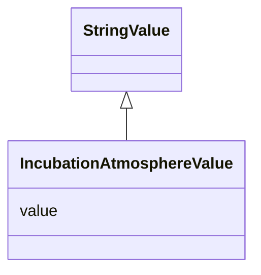

# Class: Incubation Atmosphere Value (IncubationAtmosphereValue)


_An override of StringValue allowing only values from the IncubationAtmosphereEnum enum_


URI: [microbial_experiment_schema:IncubationAtmosphereValue](https://w3id.org/usnistgov/microbial-experiment-schema/IncubationAtmosphereValue)





## Inheritance
* [StringValue](StringValue.md)
    * **IncubationAtmosphereValue**


## Slots

| Name | Cardinality and Range | Description | Inheritance |
| ---  | --- | --- | --- |
| [value](value.md) | 0..1 <br/> [String](String.md) |  | direct |


## Usages

| used by | used in | type | used |
| ---  | --- | --- | --- |
| [CytoFLEXAcquisition](CytoFLEXAcquisition.md) | [incubation_atmosphere](incubation_atmosphere.md) | range | [IncubationAtmosphereValue](IncubationAtmosphereValue.md) |
| [CellCultureInBroth](CellCultureInBroth.md) | [incubation_atmosphere](incubation_atmosphere.md) | range | [IncubationAtmosphereValue](IncubationAtmosphereValue.md) |
| [GenericTemplateDeprecated](GenericTemplateDeprecated.md) | [incubation_atmosphere](incubation_atmosphere.md) | range | [IncubationAtmosphereValue](IncubationAtmosphereValue.md) |
| [FormaldehydeFixation](FormaldehydeFixation.md) | [incubation_atmosphere](incubation_atmosphere.md) | range | [IncubationAtmosphereValue](IncubationAtmosphereValue.md) |
| [MicroscopyAcquisition](MicroscopyAcquisition.md) | [incubation_atmosphere](incubation_atmosphere.md) | range | [IncubationAtmosphereValue](IncubationAtmosphereValue.md) |
| [GenericTemplate](GenericTemplate.md) | [incubation_atmosphere](incubation_atmosphere.md) | range | [IncubationAtmosphereValue](IncubationAtmosphereValue.md) |
| [CFU](CFU.md) | [incubation_atmosphere](incubation_atmosphere.md) | range | [IncubationAtmosphereValue](IncubationAtmosphereValue.md) |
| [InitiateGrowthOfBSpizizenii](InitiateGrowthOfBSpizizenii.md) | [incubation_atmosphere](incubation_atmosphere.md) | range | [IncubationAtmosphereValue](IncubationAtmosphereValue.md) |


## Identifier and Mapping Information


### Schema Source


* from schema: https://w3id.org/usnistgov/microbial-experiment-schema


## Mappings

| Mapping Type | Mapped Value |
| ---  | ---  |
| self | microbial_experiment_schema:IncubationAtmosphereValue |
| native | microbial_experiment_schema:IncubationAtmosphereValue |


## LinkML Source

<!-- TODO: investigate https://stackoverflow.com/questions/37606292/how-to-create-tabbed-code-blocks-in-mkdocs-or-sphinx -->

### Direct

<details>
```yaml
name: IncubationAtmosphereValue
description: An override of StringValue allowing only values from the IncubationAtmosphereEnum
  enum
title: Incubation Atmosphere Value
from_schema: https://w3id.org/usnistgov/microbial-experiment-schema
is_a: StringValue
attributes:
  value:
    name: value
    from_schema: https://w3id.org/usnistgov/microbial-experiment-schema
    ifabsent: Atmospheric
    domain_of:
    - BooleanValue
    - NumberValue
    - StringValue
    - UriValue
    - DateValue
    - ArrayValue
    - ELabItemValue
    - FCInjectionModeValue
    - IncubationAtmosphereValue
    range: IncubationAtmosphereEnum

```
</details>

### Induced

<details>
```yaml
name: IncubationAtmosphereValue
description: An override of StringValue allowing only values from the IncubationAtmosphereEnum
  enum
title: Incubation Atmosphere Value
from_schema: https://w3id.org/usnistgov/microbial-experiment-schema
is_a: StringValue
attributes:
  value:
    name: value
    from_schema: https://w3id.org/usnistgov/microbial-experiment-schema
    ifabsent: Atmospheric
    alias: value
    owner: IncubationAtmosphereValue
    domain_of:
    - BooleanValue
    - NumberValue
    - StringValue
    - UriValue
    - DateValue
    - ArrayValue
    - ELabItemValue
    - FCInjectionModeValue
    - IncubationAtmosphereValue
    range: string

```
</details>