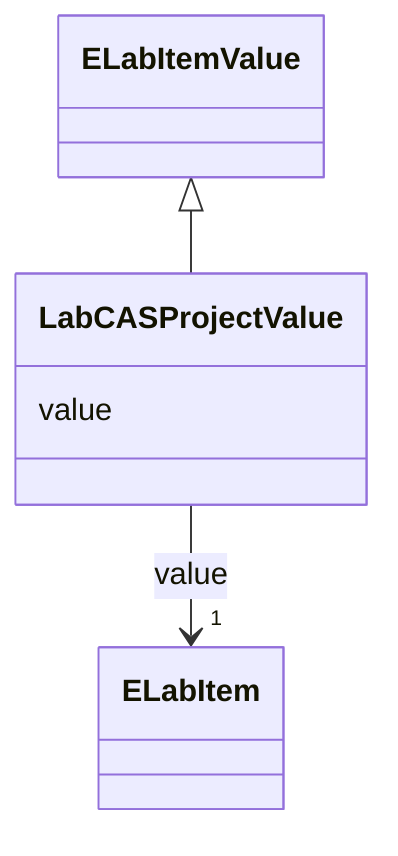

# Class: ~~LabCAS-ProjectValue (LabCASProjectValue)~~<span style="color: #ff5252;"><strong> (DEPRECATED) </strong></span>


_A named sub-class of ELabItemValue to hold the project identifier_


* __NOTE__ this element has been deprecated with the following note:
    * *(2024 June) this is too specific, use ProjectIDValue instead*
    * Element has been replaced by [ProjectIDValue](ProjectIDValue.md)


URI: [microbial_experiment_schema:LabCASProjectValue](https://w3id.org/usnistgov/microbial-experiment-schema/LabCASProjectValue)





## Inheritance
* [ELabItemValue](ELabItemValue.md)
    * **LabCASProjectValue**


## Slots

| Name | Cardinality and Range | Description | Inheritance |
| ---  | --- | --- | --- |
| [value](value.md) | 1 <br/> [ELabItem](ELabItem.md) | The actual metadata value for an attribute | [ELabItemValue](ELabItemValue.md) |


## Usages

| used by | used in | type | used |
| ---  | --- | --- | --- |
| [GenericTemplateDeprecated](GenericTemplateDeprecated.md) | [labcas_project](labcas_project.md) | range | [LabCASProjectValue](LabCASProjectValue.md) |


## Identifier and Mapping Information


### Schema Source


* from schema: https://w3id.org/usnistgov/microbial-experiment-schema


## Mappings

| Mapping Type | Mapped Value |
| ---  | ---  |
| self | microbial_experiment_schema:LabCASProjectValue |
| native | microbial_experiment_schema:LabCASProjectValue |


## LinkML Source

<!-- TODO: investigate https://stackoverflow.com/questions/37606292/how-to-create-tabbed-code-blocks-in-mkdocs-or-sphinx -->

### Direct

<details>
```yaml
name: LabCASProjectValue
description: A named sub-class of ELabItemValue to hold the project identifier
title: LabCAS-ProjectValue
deprecated: (2024 June) this is too specific, use ProjectIDValue instead
from_schema: https://w3id.org/usnistgov/microbial-experiment-schema
deprecated_element_has_exact_replacement: ProjectIDValue
is_a: ELabItemValue

```
</details>

### Induced

<details>
```yaml
name: LabCASProjectValue
description: A named sub-class of ELabItemValue to hold the project identifier
title: LabCAS-ProjectValue
deprecated: (2024 June) this is too specific, use ProjectIDValue instead
from_schema: https://w3id.org/usnistgov/microbial-experiment-schema
deprecated_element_has_exact_replacement: ProjectIDValue
is_a: ELabItemValue
attributes:
  value:
    name: value
    description: The actual metadata value for an attribute
    title: value
    from_schema: https://w3id.org/usnistgov/microbial-experiment-schema
    rank: 1000
    alias: value
    owner: LabCASProjectValue
    domain_of:
    - BooleanValue
    - NumberValue
    - StringValue
    - UriValue
    - DateValue
    - ArrayValue
    - ELabItemValue
    - FCInjectionModeValue
    - IncubationAtmosphereValue
    range: ELabItem
    required: true
    inlined: true

```
</details>