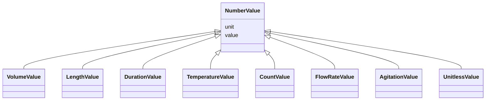

# Class: Number Value (NumberValue)


_A class to hold a numerical value with a free-text string as a unit_


URI: [microbial_experiment_schema:NumberValue](https://w3id.org/usnistgov/microbial-experiment-schema/NumberValue)





## Inheritance
* **NumberValue**
    * [VolumeValue](VolumeValue.md)
    * [LengthValue](LengthValue.md)
    * [DurationValue](DurationValue.md)
    * [TemperatureValue](TemperatureValue.md)
    * [CountValue](CountValue.md)
    * [FlowRateValue](FlowRateValue.md)
    * [AgitationValue](AgitationValue.md)
    * [UnitlessValue](UnitlessValue.md)


## Slots

| Name | Cardinality and Range | Description | Inheritance |
| ---  | --- | --- | --- |
| [value](value.md) | 1 <br/> [Decimal](Decimal.md) | The actual metadata value for an attribute | direct |
| [unit](unit.md) | 0..1 <br/> [String](String.md) | The unit corresponding to a metadata value | direct |


## Usages

| used by | used in | type | used |
| ---  | --- | --- | --- |
| [CytoFLEXAcquisition](CytoFLEXAcquisition.md) | [fc_acquisition_threshold_value](fc_acquisition_threshold_value.md) | range | [NumberValue](NumberValue.md) |
| [GenericTemplateDeprecated](GenericTemplateDeprecated.md) | [fc_acquisition_threshold_value](fc_acquisition_threshold_value.md) | range | [NumberValue](NumberValue.md) |
| [GenericTemplate](GenericTemplate.md) | [fc_acquisition_threshold_value](fc_acquisition_threshold_value.md) | range | [NumberValue](NumberValue.md) |


## Identifier and Mapping Information


### Schema Source


* from schema: https://w3id.org/usnistgov/microbial-experiment-schema


## Mappings

| Mapping Type | Mapped Value |
| ---  | ---  |
| self | microbial_experiment_schema:NumberValue |
| native | microbial_experiment_schema:NumberValue |


## LinkML Source

<!-- TODO: investigate https://stackoverflow.com/questions/37606292/how-to-create-tabbed-code-blocks-in-mkdocs-or-sphinx -->

### Direct

<details>
```yaml
name: NumberValue
description: A class to hold a numerical value with a free-text string as a unit
title: Number Value
from_schema: https://w3id.org/usnistgov/microbial-experiment-schema
slots:
- value
- unit
slot_usage:
  value:
    name: value
    range: decimal
  unit:
    name: unit
    range: string
    required: false

```
</details>

### Induced

<details>
```yaml
name: NumberValue
description: A class to hold a numerical value with a free-text string as a unit
title: Number Value
from_schema: https://w3id.org/usnistgov/microbial-experiment-schema
slot_usage:
  value:
    name: value
    range: decimal
  unit:
    name: unit
    range: string
    required: false
attributes:
  value:
    name: value
    description: The actual metadata value for an attribute
    title: value
    from_schema: https://w3id.org/usnistgov/microbial-experiment-schema
    rank: 1000
    alias: value
    owner: NumberValue
    domain_of:
    - BooleanValue
    - NumberValue
    - StringValue
    - UriValue
    - DateValue
    - ArrayValue
    - ELabItemValue
    - FCInjectionModeValue
    - IncubationAtmosphereValue
    range: decimal
    required: true
  unit:
    name: unit
    description: The unit corresponding to a metadata value
    title: unit
    from_schema: https://w3id.org/usnistgov/microbial-experiment-schema
    rank: 1000
    alias: unit
    owner: NumberValue
    domain_of:
    - NumberValue
    range: string
    required: false

```
</details>