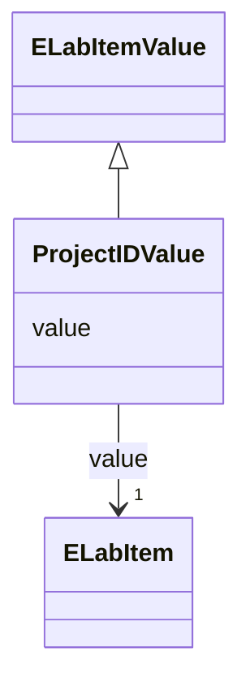

# Class: Project ID Value (ProjectIDValue)


_A named sub-class of ELabItemValue to hold a project identifier value_


URI: [microbial_experiment_schema:ProjectIDValue](https://w3id.org/usnistgov/microbial-experiment-schema/ProjectIDValue)





## Inheritance
* [ELabItemValue](ELabItemValue.md)
    * **ProjectIDValue**


## Slots

| Name | Cardinality and Range | Description | Inheritance |
| ---  | --- | --- | --- |
| [value](value.md) | 1 <br/> [ELabItem](ELabItem.md) | The actual metadata value for an attribute | [ELabItemValue](ELabItemValue.md) |


## Identifier and Mapping Information


### Schema Source


* from schema: https://w3id.org/usnistgov/microbial-experiment-schema


## Mappings

| Mapping Type | Mapped Value |
| ---  | ---  |
| self | microbial_experiment_schema:ProjectIDValue |
| native | microbial_experiment_schema:ProjectIDValue |


## LinkML Source

<!-- TODO: investigate https://stackoverflow.com/questions/37606292/how-to-create-tabbed-code-blocks-in-mkdocs-or-sphinx -->

### Direct

<details>
```yaml
name: ProjectIDValue
description: A named sub-class of ELabItemValue to hold a project identifier value
title: Project ID Value
from_schema: https://w3id.org/usnistgov/microbial-experiment-schema
is_a: ELabItemValue

```
</details>

### Induced

<details>
```yaml
name: ProjectIDValue
description: A named sub-class of ELabItemValue to hold a project identifier value
title: Project ID Value
from_schema: https://w3id.org/usnistgov/microbial-experiment-schema
is_a: ELabItemValue
attributes:
  value:
    name: value
    description: The actual metadata value for an attribute
    title: value
    from_schema: https://w3id.org/usnistgov/microbial-experiment-schema
    rank: 1000
    alias: value
    owner: ProjectIDValue
    domain_of:
    - BooleanValue
    - NumberValue
    - StringValue
    - UriValue
    - DateValue
    - ArrayValue
    - ELabItemValue
    - FCInjectionModeValue
    - IncubationAtmosphereValue
    range: ELabItem
    required: true
    inlined: true

```
</details>