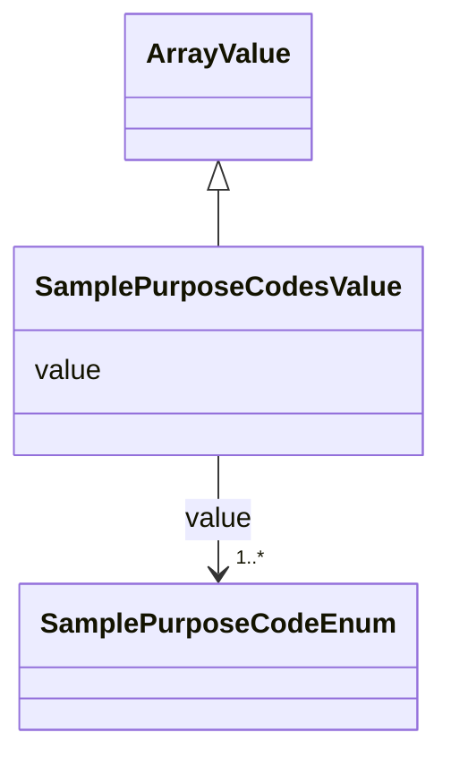

# Class: Sample Purpose Codes Value (SamplePurposeCodesValue)


_An override of ArrayValue allowing only values from the SamplePurposeCodeEnum enum_


URI: [microbial_experiment_schema:SamplePurposeCodesValue](https://w3id.org/usnistgov/microbial-experiment-schema/SamplePurposeCodesValue)





## Inheritance
* [ArrayValue](ArrayValue.md)
    * **SamplePurposeCodesValue**


## Slots

| Name | Cardinality and Range | Description | Inheritance |
| ---  | --- | --- | --- |
| [value](value.md) | 1..* <br/> [SamplePurposeCodeEnum](SamplePurposeCodeEnum.md) | The actual metadata value for an attribute | [ArrayValue](ArrayValue.md) |


## Usages

| used by | used in | type | used |
| ---  | --- | --- | --- |
| [CytoFLEXAcquisition](CytoFLEXAcquisition.md) | [sample_purpose_codes](sample_purpose_codes.md) | range | [SamplePurposeCodesValue](SamplePurposeCodesValue.md) |
| [NucleicAcidExtraction](NucleicAcidExtraction.md) | [sample_purpose_codes](sample_purpose_codes.md) | range | [SamplePurposeCodesValue](SamplePurposeCodesValue.md) |
| [CellCultureInBroth](CellCultureInBroth.md) | [sample_purpose_codes](sample_purpose_codes.md) | range | [SamplePurposeCodesValue](SamplePurposeCodesValue.md) |
| [GenericTemplateDeprecated](GenericTemplateDeprecated.md) | [sample_purpose_codes](sample_purpose_codes.md) | range | [SamplePurposeCodesValue](SamplePurposeCodesValue.md) |
| [FormaldehydeFixation](FormaldehydeFixation.md) | [sample_purpose_codes](sample_purpose_codes.md) | range | [SamplePurposeCodesValue](SamplePurposeCodesValue.md) |
| [MicroscopyAcquisition](MicroscopyAcquisition.md) | [sample_purpose_codes](sample_purpose_codes.md) | range | [SamplePurposeCodesValue](SamplePurposeCodesValue.md) |
| [GenericTemplate](GenericTemplate.md) | [sample_purpose_codes](sample_purpose_codes.md) | range | [SamplePurposeCodesValue](SamplePurposeCodesValue.md) |
| [CoulterAcquisition](CoulterAcquisition.md) | [sample_purpose_codes](sample_purpose_codes.md) | range | [SamplePurposeCodesValue](SamplePurposeCodesValue.md) |
| [BactoBoxAcquisition](BactoBoxAcquisition.md) | [sample_purpose_codes](sample_purpose_codes.md) | range | [SamplePurposeCodesValue](SamplePurposeCodesValue.md) |
| [LogCOMETSamplePrep](LogCOMETSamplePrep.md) | [sample_purpose_codes](sample_purpose_codes.md) | range | [SamplePurposeCodesValue](SamplePurposeCodesValue.md) |
| [CFU](CFU.md) | [sample_purpose_codes](sample_purpose_codes.md) | range | [SamplePurposeCodesValue](SamplePurposeCodesValue.md) |
| [InitiateGrowthOfBSpizizenii](InitiateGrowthOfBSpizizenii.md) | [sample_purpose_codes](sample_purpose_codes.md) | range | [SamplePurposeCodesValue](SamplePurposeCodesValue.md) |


## Identifier and Mapping Information


### Schema Source


* from schema: https://w3id.org/usnistgov/microbial-experiment-schema


## Mappings

| Mapping Type | Mapped Value |
| ---  | ---  |
| self | microbial_experiment_schema:SamplePurposeCodesValue |
| native | microbial_experiment_schema:SamplePurposeCodesValue |


## LinkML Source

<!-- TODO: investigate https://stackoverflow.com/questions/37606292/how-to-create-tabbed-code-blocks-in-mkdocs-or-sphinx -->

### Direct

<details>
```yaml
name: SamplePurposeCodesValue
description: An override of ArrayValue allowing only values from the SamplePurposeCodeEnum
  enum
title: Sample Purpose Codes Value
from_schema: https://w3id.org/usnistgov/microbial-experiment-schema
is_a: ArrayValue
slot_usage:
  value:
    name: value
    range: SamplePurposeCodeEnum

```
</details>

### Induced

<details>
```yaml
name: SamplePurposeCodesValue
description: An override of ArrayValue allowing only values from the SamplePurposeCodeEnum
  enum
title: Sample Purpose Codes Value
from_schema: https://w3id.org/usnistgov/microbial-experiment-schema
is_a: ArrayValue
slot_usage:
  value:
    name: value
    range: SamplePurposeCodeEnum
attributes:
  value:
    name: value
    description: The actual metadata value for an attribute
    title: value
    from_schema: https://w3id.org/usnistgov/microbial-experiment-schema
    rank: 1000
    alias: value
    owner: SamplePurposeCodesValue
    domain_of:
    - BooleanValue
    - NumberValue
    - StringValue
    - UriValue
    - DateValue
    - ArrayValue
    - ELabItemValue
    - FCInjectionModeValue
    - IncubationAtmosphereValue
    range: SamplePurposeCodeEnum
    required: true
    multivalued: true
    inlined: false

```
</details>