# Class: String Value (StringValue)


_A class to hold a string value_


URI: [microbial_experiment_schema:StringValue](https://w3id.org/usnistgov/microbial-experiment-schema/StringValue)

```mermaid
 classDiagram
    class StringValue
    click StringValue href "../StringValue"
      StringValue <|-- FCInjectionModeValue
        click FCInjectionModeValue href "../FCInjectionModeValue"
      StringValue <|-- IncubationAtmosphereValue
        click IncubationAtmosphereValue href "../IncubationAtmosphereValue"
      StringValue <|-- NucleicAcidTypeValue
        click NucleicAcidTypeValue href "../NucleicAcidTypeValue"
      StringValue <|-- CytoFLEXAcquisitionTemplateNameValue
        click CytoFLEXAcquisitionTemplateNameValue href "../CytoFLEXAcquisitionTemplateNameValue"
      StringValue <|-- NucleicAcidExtractionTemplateNameValue
        click NucleicAcidExtractionTemplateNameValue href "../NucleicAcidExtractionTemplateNameValue"
      StringValue <|-- CellCultureInBrothTemplateNameValue
        click CellCultureInBrothTemplateNameValue href "../CellCultureInBrothTemplateNameValue"
      StringValue <|-- CytoFLEXVolumeCalibrationTemplateNameValue
        click CytoFLEXVolumeCalibrationTemplateNameValue href "../CytoFLEXVolumeCalibrationTemplateNameValue"
      StringValue <|-- FormaldehydeFixationTemplateNameValue
        click FormaldehydeFixationTemplateNameValue href "../FormaldehydeFixationTemplateNameValue"
      StringValue <|-- MicroscopyAcquisitionTemplateNameValue
        click MicroscopyAcquisitionTemplateNameValue href "../MicroscopyAcquisitionTemplateNameValue"
      StringValue <|-- CoulterAcquisitionTemplateNameValue
        click CoulterAcquisitionTemplateNameValue href "../CoulterAcquisitionTemplateNameValue"
      StringValue <|-- BactoBoxAcquisitionTemplateNameValue
        click BactoBoxAcquisitionTemplateNameValue href "../BactoBoxAcquisitionTemplateNameValue"
      StringValue <|-- LogCOMETSamplePrepTemplateNameValue
        click LogCOMETSamplePrepTemplateNameValue href "../LogCOMETSamplePrepTemplateNameValue"
      StringValue <|-- CFUTemplateNameValue
        click CFUTemplateNameValue href "../CFUTemplateNameValue"
      StringValue <|-- DifcoAmendedSporulationAgarProtocolTemplateNameValue
        click DifcoAmendedSporulationAgarProtocolTemplateNameValue href "../DifcoAmendedSporulationAgarProtocolTemplateNameValue"
      StringValue <|-- InitiateGrowthOfBSpizizeniiTemplateNameValue
        click InitiateGrowthOfBSpizizeniiTemplateNameValue href "../InitiateGrowthOfBSpizizeniiTemplateNameValue"
      StringValue <|-- SlideCleaningTemplateNameValue
        click SlideCleaningTemplateNameValue href "../SlideCleaningTemplateNameValue"
      
      StringValue : value
        
      
```





## Inheritance
* **StringValue**
    * [FCInjectionModeValue](FCInjectionModeValue.md)
    * [IncubationAtmosphereValue](IncubationAtmosphereValue.md)
    * [NucleicAcidTypeValue](NucleicAcidTypeValue.md)
    * [CytoFLEXAcquisitionTemplateNameValue](CytoFLEXAcquisitionTemplateNameValue.md)
    * [NucleicAcidExtractionTemplateNameValue](NucleicAcidExtractionTemplateNameValue.md)
    * [CellCultureInBrothTemplateNameValue](CellCultureInBrothTemplateNameValue.md)
    * [CytoFLEXVolumeCalibrationTemplateNameValue](CytoFLEXVolumeCalibrationTemplateNameValue.md)
    * [FormaldehydeFixationTemplateNameValue](FormaldehydeFixationTemplateNameValue.md)
    * [MicroscopyAcquisitionTemplateNameValue](MicroscopyAcquisitionTemplateNameValue.md)
    * [CoulterAcquisitionTemplateNameValue](CoulterAcquisitionTemplateNameValue.md)
    * [BactoBoxAcquisitionTemplateNameValue](BactoBoxAcquisitionTemplateNameValue.md)
    * [LogCOMETSamplePrepTemplateNameValue](LogCOMETSamplePrepTemplateNameValue.md)
    * [CFUTemplateNameValue](CFUTemplateNameValue.md)
    * [DifcoAmendedSporulationAgarProtocolTemplateNameValue](DifcoAmendedSporulationAgarProtocolTemplateNameValue.md)
    * [InitiateGrowthOfBSpizizeniiTemplateNameValue](InitiateGrowthOfBSpizizeniiTemplateNameValue.md)
    * [SlideCleaningTemplateNameValue](SlideCleaningTemplateNameValue.md)


## Slots

| Name | Cardinality and Range | Description | Inheritance |
| ---  | --- | --- | --- |
| [value](value.md) | 1 <br/> [String](String.md) | The actual metadata value for an attribute | direct |


## Usages

| used by | used in | type | used |
| ---  | --- | --- | --- |
| [Experiment](Experiment.md) | [template_name](template_name.md) | range | [StringValue](StringValue.md) |
| [ExperimentWithData](ExperimentWithData.md) | [core_data_path](core_data_path.md) | range | [StringValue](StringValue.md) |
| [ExperimentWithData](ExperimentWithData.md) | [specific_data_path](specific_data_path.md) | range | [StringValue](StringValue.md) |
| [ExperimentWithData](ExperimentWithData.md) | [template_name](template_name.md) | range | [StringValue](StringValue.md) |
| [ExperimentWithInstrument](ExperimentWithInstrument.md) | [core_data_path](core_data_path.md) | range | [StringValue](StringValue.md) |
| [ExperimentWithInstrument](ExperimentWithInstrument.md) | [specific_data_path](specific_data_path.md) | range | [StringValue](StringValue.md) |
| [ExperimentWithInstrument](ExperimentWithInstrument.md) | [template_name](template_name.md) | range | [StringValue](StringValue.md) |
| [ExperimentWithInstrumentNoData](ExperimentWithInstrumentNoData.md) | [template_name](template_name.md) | range | [StringValue](StringValue.md) |
| [CytoFLEXAcquisition](CytoFLEXAcquisition.md) | [fc_acquisition_threshold_channel](fc_acquisition_threshold_channel.md) | range | [StringValue](StringValue.md) |
| [CytoFLEXAcquisition](CytoFLEXAcquisition.md) | [core_data_path](core_data_path.md) | range | [StringValue](StringValue.md) |
| [CytoFLEXAcquisition](CytoFLEXAcquisition.md) | [specific_data_path](specific_data_path.md) | range | [StringValue](StringValue.md) |
| [NucleicAcidExtraction](NucleicAcidExtraction.md) | [core_data_path](core_data_path.md) | range | [StringValue](StringValue.md) |
| [NucleicAcidExtraction](NucleicAcidExtraction.md) | [specific_data_path](specific_data_path.md) | range | [StringValue](StringValue.md) |
| [GenericTemplateDeprecated](GenericTemplateDeprecated.md) | [bead_lot_number_concentration_qc](bead_lot_number_concentration_qc.md) | range | [StringValue](StringValue.md) |
| [GenericTemplateDeprecated](GenericTemplateDeprecated.md) | [bead_lot_number_size_qc](bead_lot_number_size_qc.md) | range | [StringValue](StringValue.md) |
| [GenericTemplateDeprecated](GenericTemplateDeprecated.md) | [fc_acquisition_threshold_channel](fc_acquisition_threshold_channel.md) | range | [StringValue](StringValue.md) |
| [GenericTemplateDeprecated](GenericTemplateDeprecated.md) | [fc_fluorescent_channels](fc_fluorescent_channels.md) | range | [StringValue](StringValue.md) |
| [GenericTemplateDeprecated](GenericTemplateDeprecated.md) | [library_prep](library_prep.md) | range | [StringValue](StringValue.md) |
| [GenericTemplateDeprecated](GenericTemplateDeprecated.md) | [qc_reagent_lot_number](qc_reagent_lot_number.md) | range | [StringValue](StringValue.md) |
| [GenericTemplateDeprecated](GenericTemplateDeprecated.md) | [core_data_path](core_data_path.md) | range | [StringValue](StringValue.md) |
| [GenericTemplateDeprecated](GenericTemplateDeprecated.md) | [specific_data_path](specific_data_path.md) | range | [StringValue](StringValue.md) |
| [GenericTemplateDeprecated](GenericTemplateDeprecated.md) | [template_name](template_name.md) | range | [StringValue](StringValue.md) |
| [MicroscopyAcquisition](MicroscopyAcquisition.md) | [core_data_path](core_data_path.md) | range | [StringValue](StringValue.md) |
| [MicroscopyAcquisition](MicroscopyAcquisition.md) | [specific_data_path](specific_data_path.md) | range | [StringValue](StringValue.md) |
| [GenericTemplate](GenericTemplate.md) | [fc_acquisition_threshold_channel](fc_acquisition_threshold_channel.md) | range | [StringValue](StringValue.md) |
| [GenericTemplate](GenericTemplate.md) | [library_prep](library_prep.md) | range | [StringValue](StringValue.md) |
| [GenericTemplate](GenericTemplate.md) | [core_data_path](core_data_path.md) | range | [StringValue](StringValue.md) |
| [GenericTemplate](GenericTemplate.md) | [specific_data_path](specific_data_path.md) | range | [StringValue](StringValue.md) |
| [GenericTemplate](GenericTemplate.md) | [template_name](template_name.md) | range | [StringValue](StringValue.md) |
| [CoulterAcquisition](CoulterAcquisition.md) | [core_data_path](core_data_path.md) | range | [StringValue](StringValue.md) |
| [CoulterAcquisition](CoulterAcquisition.md) | [specific_data_path](specific_data_path.md) | range | [StringValue](StringValue.md) |
| [BactoBoxAcquisition](BactoBoxAcquisition.md) | [core_data_path](core_data_path.md) | range | [StringValue](StringValue.md) |
| [BactoBoxAcquisition](BactoBoxAcquisition.md) | [specific_data_path](specific_data_path.md) | range | [StringValue](StringValue.md) |
| [CFU](CFU.md) | [core_data_path](core_data_path.md) | range | [StringValue](StringValue.md) |
| [CFU](CFU.md) | [specific_data_path](specific_data_path.md) | range | [StringValue](StringValue.md) |


## Identifier and Mapping Information


### Schema Source


* from schema: https://w3id.org/usnistgov/microbial-experiment-schema


## Mappings

| Mapping Type | Mapped Value |
| ---  | ---  |
| self | microbial_experiment_schema:StringValue |
| native | microbial_experiment_schema:StringValue |


## LinkML Source

<!-- TODO: investigate https://stackoverflow.com/questions/37606292/how-to-create-tabbed-code-blocks-in-mkdocs-or-sphinx -->

### Direct

<details>
```yaml
name: StringValue
description: A class to hold a string value
title: String Value
from_schema: https://w3id.org/usnistgov/microbial-experiment-schema
slots:
- value
slot_usage:
  value:
    name: value
    range: string

```
</details>

### Induced

<details>
```yaml
name: StringValue
description: A class to hold a string value
title: String Value
from_schema: https://w3id.org/usnistgov/microbial-experiment-schema
slot_usage:
  value:
    name: value
    range: string
attributes:
  value:
    name: value
    description: The actual metadata value for an attribute
    title: value
    from_schema: https://w3id.org/usnistgov/microbial-experiment-schema
    rank: 1000
    alias: value
    owner: StringValue
    domain_of:
    - BooleanValue
    - NumberValue
    - StringValue
    - UriValue
    - DateValue
    - ArrayValue
    - ELabItemValue
    - FCInjectionModeValue
    - IncubationAtmosphereValue
    range: string
    required: true

```
</details>